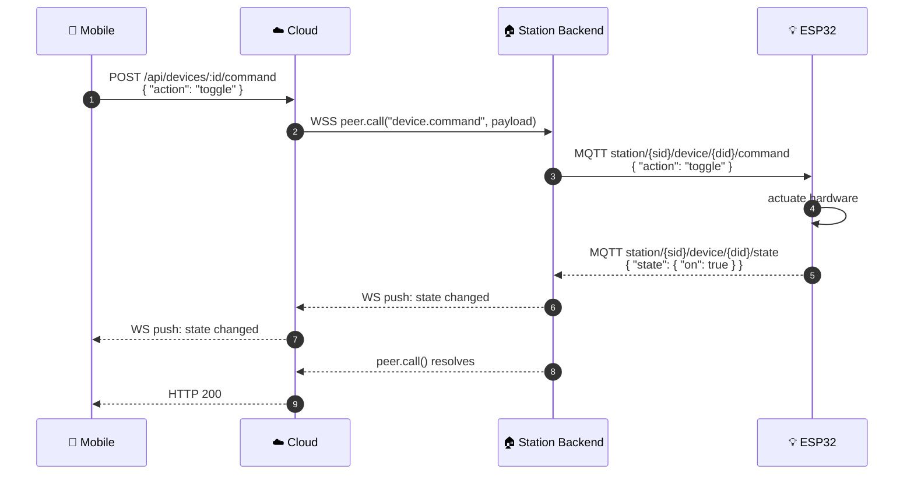
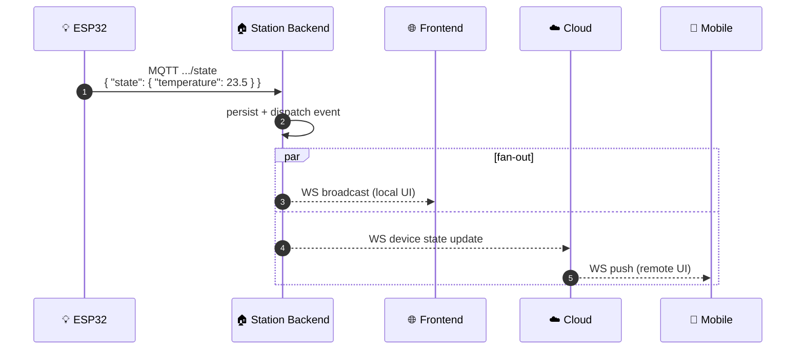
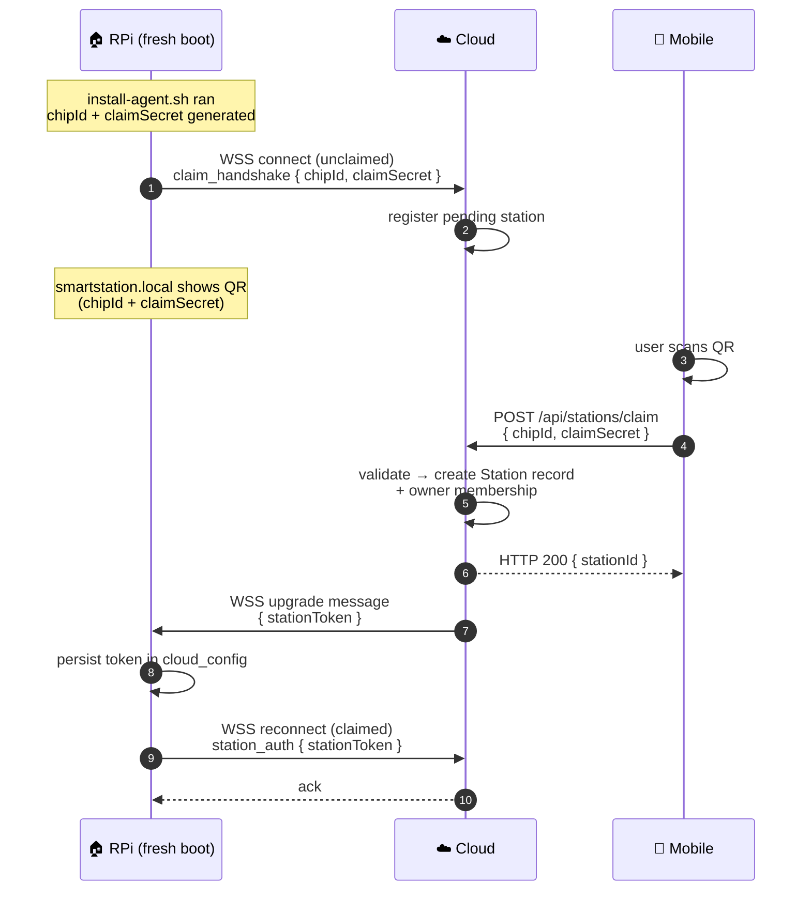
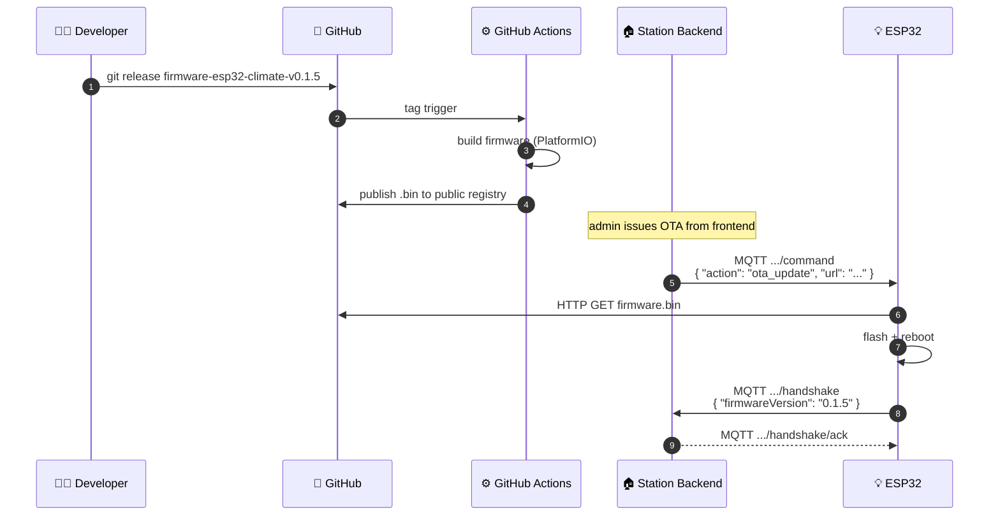
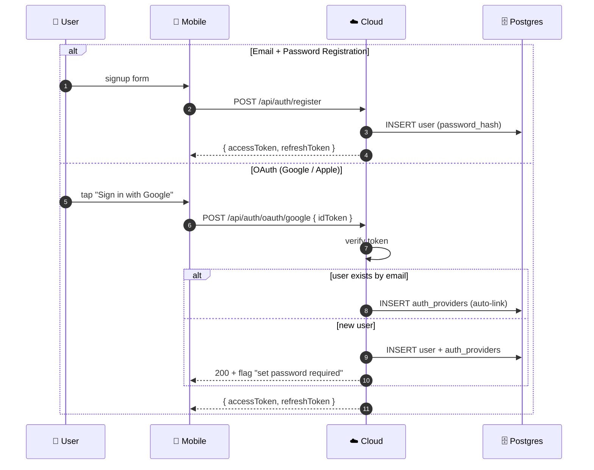
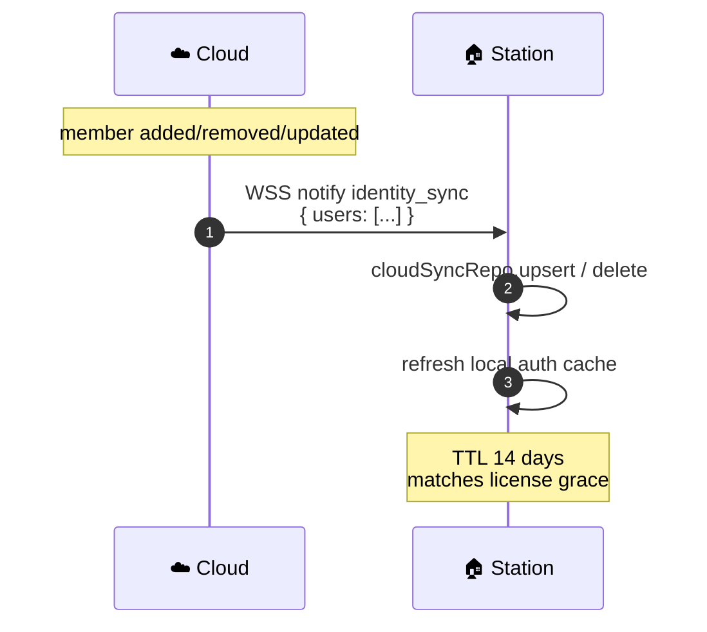
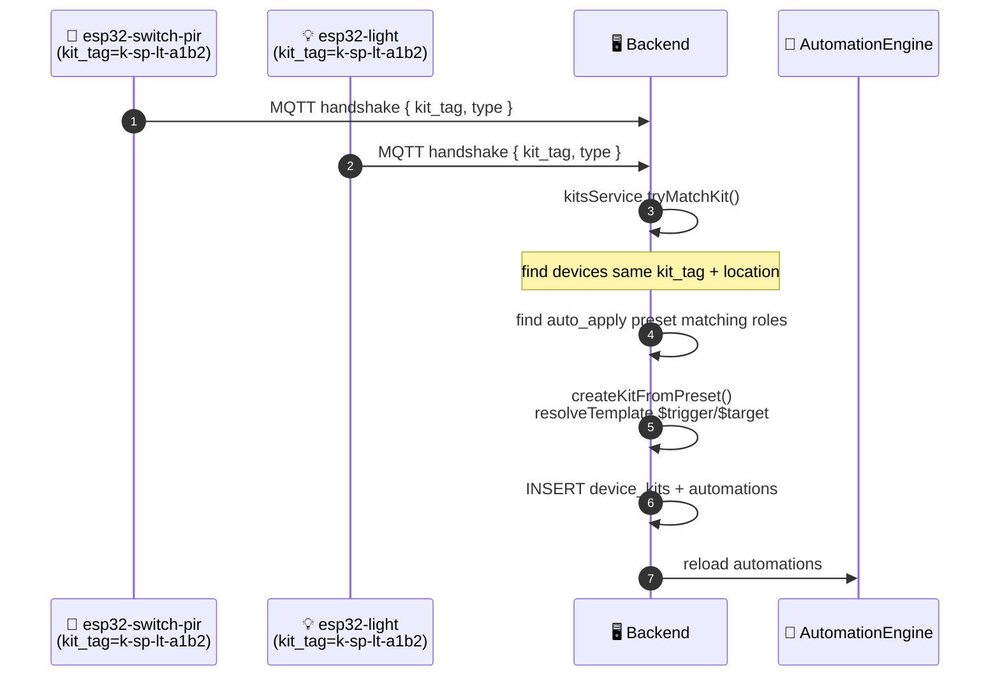
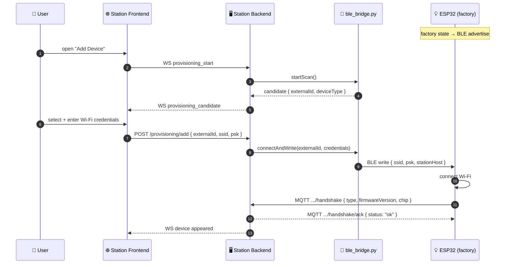

# 🌊 Data Flows

Sequence diagrams for the system's major operations.

## 1. Mobile Controls a Device {#device-control}

The mobile app sends a command (e.g. toggle a light). Mobile never reaches the Station directly — Cloud relays via WSS.

## 2. Device Telemetry {#telemetry}

ESP32 publishes sensor readings; the system fans them out to all connected clients.

## 3. Station Claiming {#claiming}

A fresh Raspberry Pi connects to Cloud as **unclaimed**. The owner scans a QR code in the mobile app to claim it.

## 4. OTA Firmware Update {#ota}

Developer cuts a firmware release tag; CI publishes; Station instructs ESP32 to flash over MQTT.

## 5. Authentication {#auth}

## 6. Identity Cache Sync {#identity-sync}

Station caches member identities locally so it can authenticate users on LAN even when offline.

## 7. Kit Auto-Creation {#kit-creation}

When two ESP32 devices with the same `kit_tag` come online, Station auto-creates a kit and applies preset automations.

## 8. BLE Provisioning {#ble-provisioning}

Adding a new ESP32 to the network — the **Station backend (RPi)** scans via BLE and provisions the device. The user interacts through the Station Frontend SPA.

