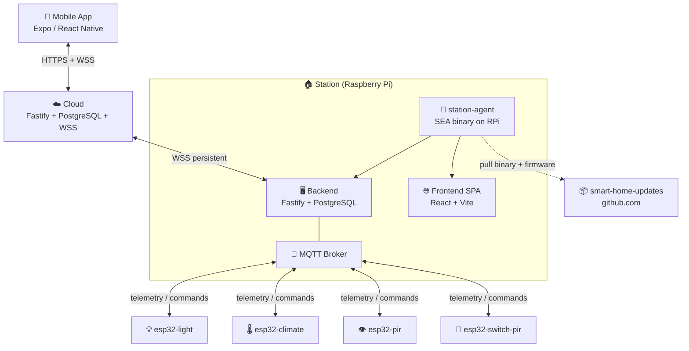

# 🏗️ System Overview

The Svaroh platform consists of four repositories working together: a station running on Raspberry Pi, a cloud relay, a mobile app, and a public artifact repo.

## Topology

:::tip Station works offline
Cloud is **optional**. All core functionality (device control, automations, local UI) runs on Raspberry Pi without internet. Cloud only adds remote/mobile access.
:::

## Repositories

| Repo | Role | GitHub |
|---|---|---|
| `smart-home` | Station monorepo: backend, frontend, ESP32 firmware, station-agent | [↗](https://github.com/alphaoflogic-ua/smart-home) |
| `smart-home-cloud` | Cloud API: auth, relay, station claiming | [↗](https://github.com/alphaoflogic-ua/smart-home-cloud) |
| `smart-home-mobile` | Expo / React Native mobile app | [↗](https://github.com/alphaoflogic-ua/smart-home-mobile) |
| `smart-home-updates` | Public distribution: agent binary, firmware, install scripts | [↗](https://github.com/alphaoflogic-ua/smart-home-updates) |

## Component Responsibilities {#components}

### 📱 Mobile App
- Expo / React Native, talks **only** to Cloud (HTTPS + WSS)
- Never connects directly to Station
- BLE provisioning of new ESP32 devices
- [Source ↗](https://github.com/alphaoflogic-ua/smart-home-mobile)

### ☁️ Cloud
- Fastify + PostgreSQL + WebSocket server
- Owns: users, auth, station registry
- Does **not** store device data — proxies via JSON-RPC `peer.call()` over WSS to Station
- [Source ↗](https://github.com/alphaoflogic-ua/smart-home-cloud)

### 🏠 Station (Raspberry Pi)
- **station-agent** — SEA Node binary, manages Docker, self-updates from `smart-home-updates`
- **backend** (Docker) — Fastify, owns device data, MQTT bridge, WebSocket for frontend
- **frontend** (Docker) — React SPA, served by Nginx
- **PostgreSQL + MQTT** (Docker)
- [Source ↗](https://github.com/alphaoflogic-ua/smart-home)

### 💡 ESP32 Devices
- PlatformIO projects per device type: `esp32-climate`, `esp32-pir`, `esp32-light`, `esp32-switch-pir`
- All built on shared `SmartHomeCore` library (Wi-Fi, MQTT, BLE, OTA)
- Connect to Station's MQTT broker
- [Source ↗](https://github.com/alphaoflogic-ua/smart-home/tree/develop/firmware)

## Key Principles

- ✅ **Mobile talks ONLY to Cloud** — never directly to Station
- ✅ **Cloud is a relay** — device data lives on Station
- ✅ **Station works offline** — Cloud is optional
- ✅ **Updates are pulled** — Station fetches artifacts from public GitHub repo
