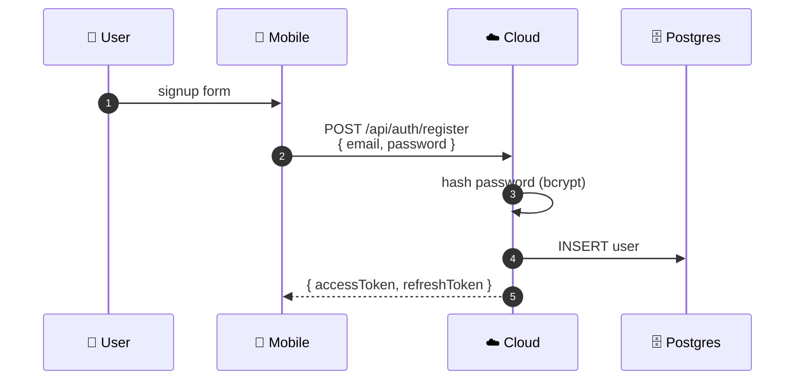
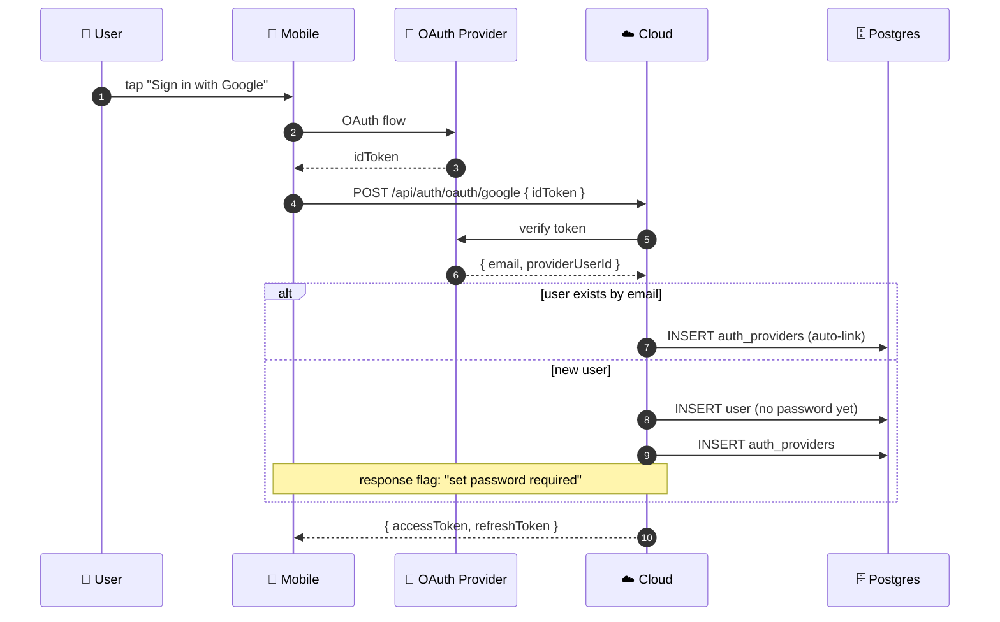
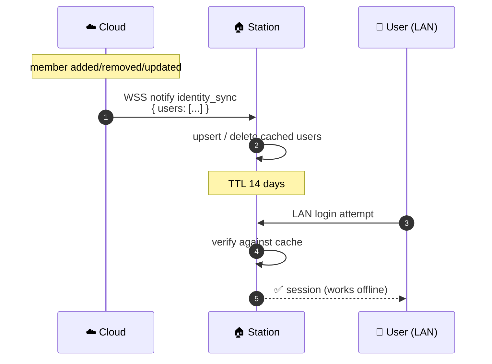
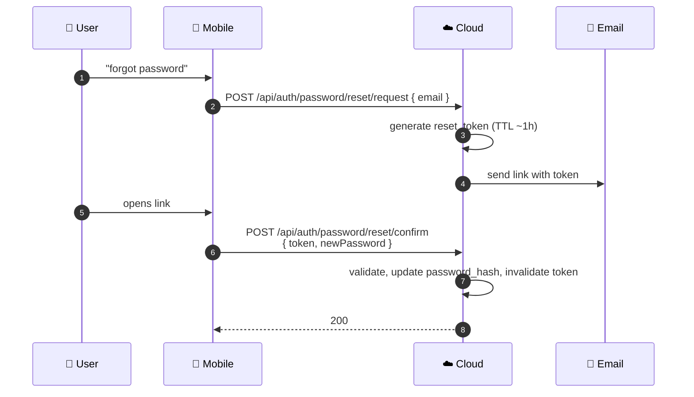

# 🔐 Authentication

Cloud handles all user authentication. Stations cache identity locally for LAN-offline operation.

## Registration

### Email + Password {#email-register}

### OAuth (Google / Apple) {#oauth-register}

:::warning OAuth users must set a password
A password is **required** for Station LAN access without internet (Pi can't reach OAuth providers offline). Mobile prompts the user to set one after OAuth registration.
:::

## Login {#login}

- **Password:** standard email/password — works for all users regardless of registration method.
- **OAuth:** match by `(provider, provider_user_id)` in `auth_providers`.
- **Auto-linking:** if a user registered with password and later signs in with Google, the email match adds an `auth_providers` row automatically.

## Identity Cache on Station {#cache}

First-time login on Station requires internet (redirect to Cloud OAuth). Subsequent LAN logins work offline up to TTL.

## Password Reset {#reset}

## JWT Lifecycle

- `accessToken` — short-lived (~15 min), Bearer in `Authorization` header
- `refreshToken` — long-lived (~14 days), refreshed via `POST /api/auth/refresh`
- Refresh token rotation: each refresh issues a new pair, old refresh is invalidated

## Reference

- [auth module ↗](https://github.com/alphaoflogic-ua/smart-home-cloud/tree/develop/src/modules/auth)
- [authHooks ↗](https://github.com/alphaoflogic-ua/smart-home-cloud/blob/develop/src/hooks/authHooks.ts)
