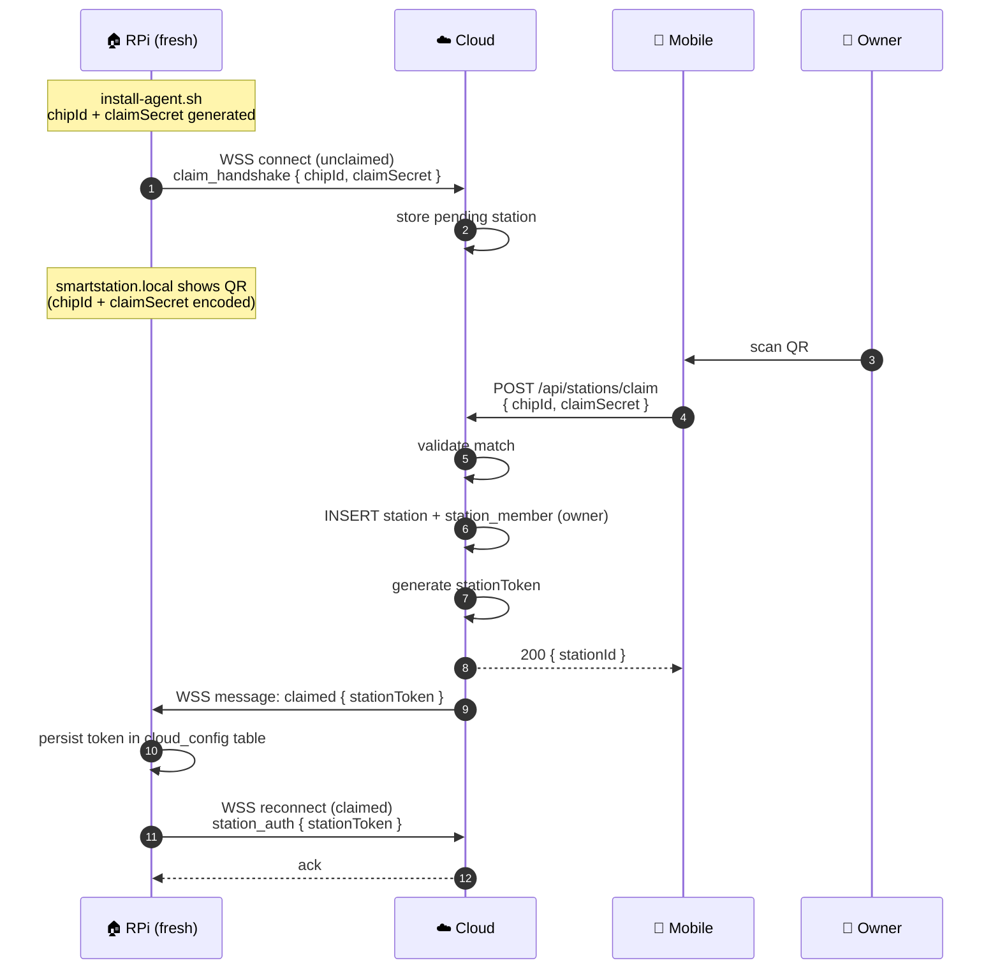
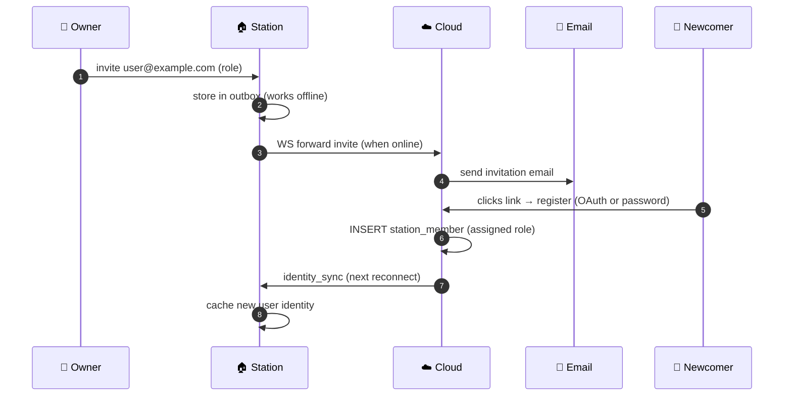

# 🎯 Station Claiming

A fresh Raspberry Pi connects to Cloud as **unclaimed** and waits for an owner.

## Bootstrap Sequence {#sequence}

## Rules

- **Only owner** uses the claim flow. Other members are added via [invite](#invites).
- Claim token is one-time — invalidated after successful claim.
- Stations stay on passwords (no OAuth on Station side); the `auth_providers` table exists on Station but stays empty.

## Invite Flow {#invites}

## Reference

- [stations module ↗](https://github.com/alphaoflogic-ua/smart-home-cloud/tree/develop/src/modules/stations)
- [cloud-sync (Station side) ↗](https://github.com/alphaoflogic-ua/smart-home/tree/develop/packages/backend/src/modules/cloud-sync)
