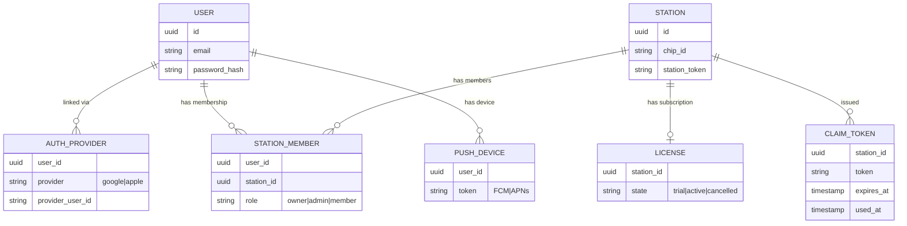

# 🗄️ Cloud Data Model

## Entities {#entities}

| Entity | Description |
|---|---|
| **User** | Cloud account. One person = one account. Auth via OAuth (Google, Apple) or email/password. `password_hash` is **always** set — OAuth users must set a password (required for Station LAN access offline). |
| **AuthProvider** | OAuth link. Auto-linked by email when a password user later signs in via OAuth. |
| **Station** | One Raspberry Pi. Identified by `station_id` generated on first boot. |
| **StationMember** | User-station link. Roles: `owner` (full), `admin` (devices), `member` (view). |
| **License** | Subscription tied to Station. States: `trial → active → cancelled`. Without active license, cloud features stop; local features keep working. |
| **ClaimToken** | One-time code for claiming. Stored in `claim_tokens`, invalidated after use. |
| **PushDevice** | FCM/APNs token tied to a user. One user = many devices. |

## Reference

- [Cloud spec ↗](https://github.com/alphaoflogic-ua/smart-home-cloud/blob/develop/docs/cloud-spec.md)
- [Migrations ↗](https://github.com/alphaoflogic-ua/smart-home-cloud/tree/develop/src/db/migrations)
