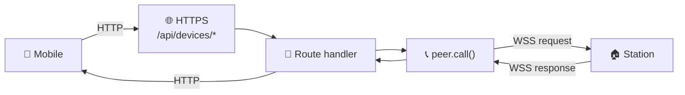
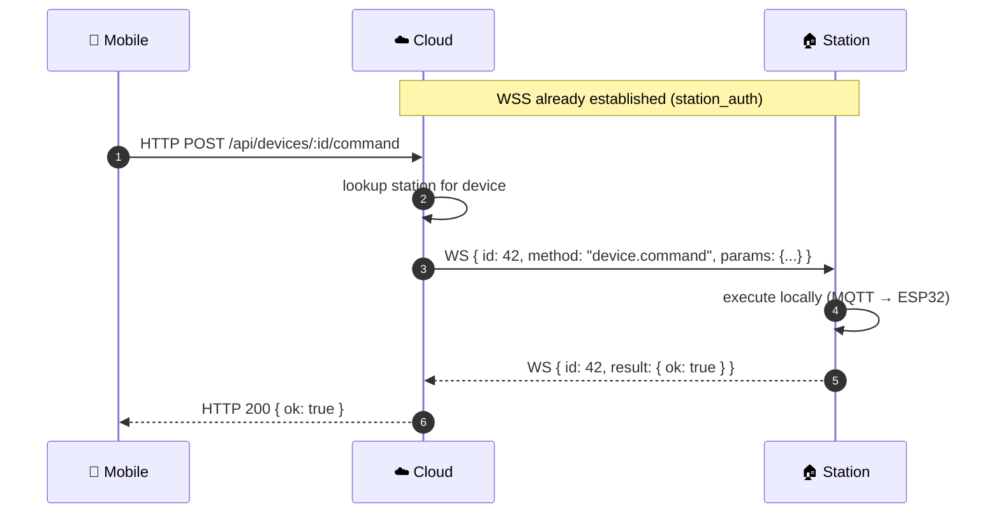

# 🔁 Cloud Relay

Cloud doesn't store device data — it proxies device requests from Mobile to the relevant Station via JSON-RPC over WSS.

## Topology {#topology}

## Lifecycle {#lifecycle}

## Primitives

| Method | Returns | Use case |
|---|---|---|
| `peer.call(method, params)` | `Promise<result>` | Request/response (waits for matching `id`) |
| `peer.notify(method, params)` | `void` | Fire-and-forget (no `id`) |

If the Station is offline, `peer.call()` rejects after timeout — Cloud returns 503 to Mobile.

## Reference

- [jsonrpc protocol ↗](https://github.com/alphaoflogic-ua/smart-home-cloud/tree/develop/src/jsonrpc)
- [devices module (proxy only) ↗](https://github.com/alphaoflogic-ua/smart-home-cloud/tree/develop/src/modules/devices)
- [ws/ ↗](https://github.com/alphaoflogic-ua/smart-home-cloud/tree/develop/src/ws)
