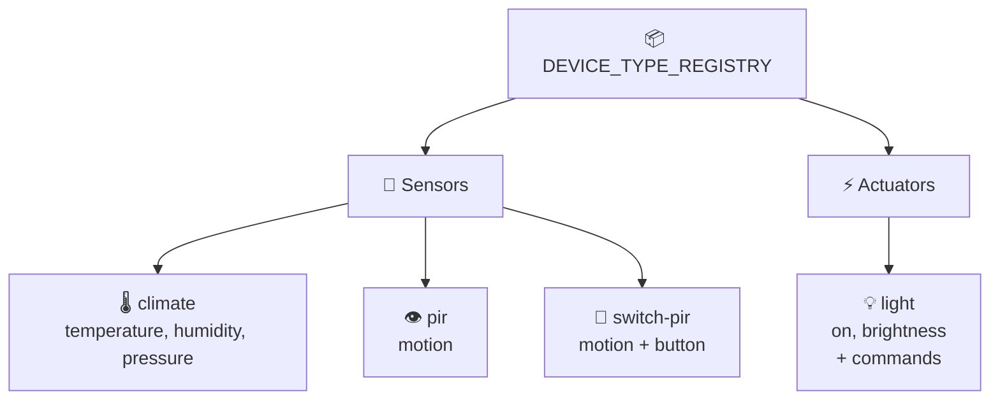
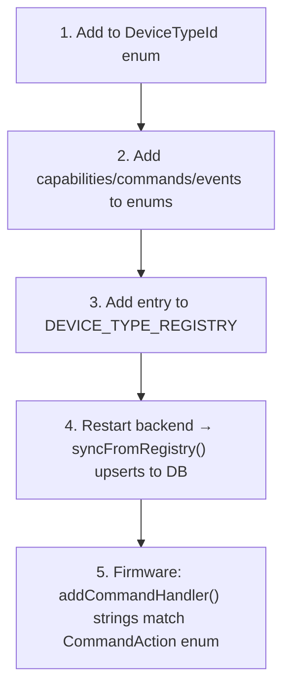

# 💡 Device Type Registry

Single source of truth: [`packages/shared/src/types/deviceTypeRegistry.ts` ↗](https://github.com/alphaoflogic-ua/smart-home/blob/develop/packages/shared/src/types/deviceTypeRegistry.ts). Backend syncs to DB on startup via `syncFromRegistry()`.

## Taxonomy {#taxonomy}

## Concepts {#concepts}

| Term | Meaning |
|---|---|
| **DeviceTypeId** | Unique identifier (matches firmware `device_type` string) |
| **Category** | `sensor` (reads env) or `actuator` (controls) |
| **Capabilities** | State keys the device publishes via MQTT (must match field name in `{"state":{...}}`) |
| **Commands** | Actions Backend sends to device (enum value matches firmware `addCommandHandler()`) |
| **Events** | Actions device publishes via MQTT `/event` topic — `device_event` (auto) or `user_event` (button press) |
| **Periodic** | `true` = device sends telemetry on interval; `false` = event-driven |

## Current Types

| Type | Category | Capabilities | Commands | Events |
|---|---|---|---|---|
| `climate` | sensor | temperature, humidity, pressure | — | — |
| `pir` | sensor | motion | — | motion_detected, motion_cleared |
| `switch-pir` | sensor | motion, button | — | button_press, motion_detected, motion_cleared |
| `light` | actuator | on, brightness | toggle, set_brightness, turn_on, turn_off | turned_on, turned_off |

## Adding a New Type {#new-type}

## Frontend Rendering

| Element | Component | Source |
|---|---|---|
| Capabilities (read-only) | `CapabilityValues` | DeviceWidget |
| Commands (button) | `CommandButtons` | `SLIDER_COMMANDS` map |
| Commands (slider) | `CommandSlider` | `SLIDER_COMMANDS` map |
| `user_event` triggers | `UserEventButtons` | virtual buttons |

## Reference

- [deviceTypeRegistry.ts ↗](https://github.com/alphaoflogic-ua/smart-home/blob/develop/packages/shared/src/types/deviceTypeRegistry.ts)
- [DeviceWidget.tsx ↗](https://github.com/alphaoflogic-ua/smart-home/blob/develop/packages/frontend/src/components/DeviceWidget.tsx)
