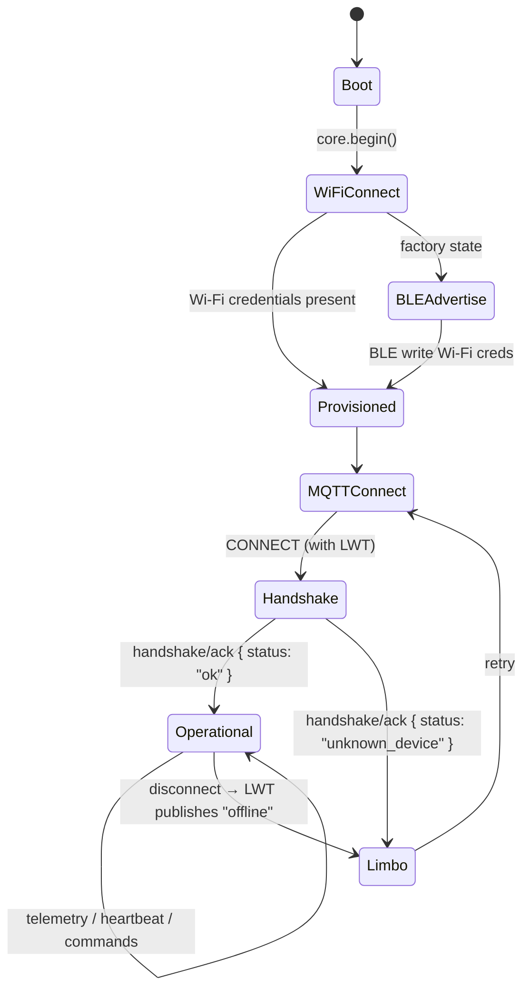

# 🔄 MQTT Lifecycle (firmware side)

How an ESP32 talks to the Backend MQTT broker, from boot to operation.



## Telemetry Pattern

```cpp
JsonDocument doc;
JsonObject state = doc["state"].to<JsonObject>();
state["temperature"] = 23.5;
state["humidity"] = 60.0;

String message;
serializeJson(doc, message);
core.mqtt().publish(topic.c_str(), message.c_str(), false);
```

- Always wrap payload in `{"state": { ... }}`
- Check `core.mqtt().connected()` before publishing
- Event-driven sensors: publish on state change
- Periodic sensors: track `lastPublishAt` with `millis()`

## See Also

- [📡 MQTT Protocol](/protocols/mqtt) — full topic and payload reference
- [🧬 SmartHomeCore](/firmware/smart-home-core) — library API
