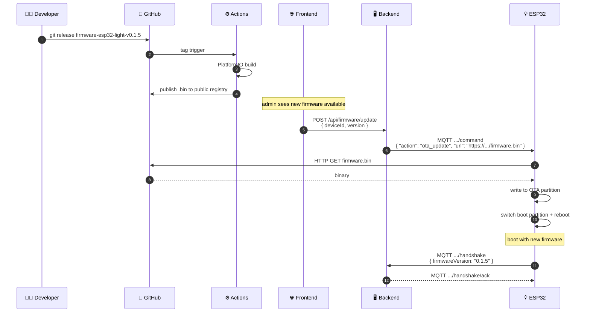

# 📡 OTA Firmware Updates

Over-the-air firmware updates triggered via MQTT command.

## End-to-End Flow {#flow}

## Triggering OTA

The backend exposes admin endpoints to push OTA. Built-in `ota_update` command is implemented inside SmartHomeCore — no per-device code needed.

## Reference

- [SmartHomeCore OTA ↗](https://github.com/alphaoflogic-ua/smart-home/tree/develop/firmware/lib/smart-home-core)
- [Firmware build script ↗](https://github.com/alphaoflogic-ua/smart-home/blob/develop/scripts/build-firmware.js)
