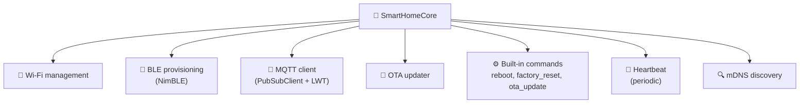

# 🧬 SmartHomeCore

Shared C++ library used by all ESP32 firmware projects. Handles Wi-Fi, MQTT (with LWT + heartbeat + mDNS), BLE provisioning, OTA, factory reset, and built-in commands.

[Source ↗](https://github.com/alphaoflogic-ua/smart-home/tree/develop/firmware/lib/smart-home-core)

## What It Provides



## Standard `main.cpp`

```cpp
#include <Arduino.h>
#include <ArduinoJson.h>
#include <smart_home_core.h>
#include "version.h"

namespace {
  SmartHomeCore core("my_type", 10000, 5000, FIRMWARE_VERSION, FIRMWARE_CHIP);
}

void setup() {
  Serial.begin(115200);
  delay(500);
  core.begin();
}

void loop() {
  core.loop();
  if (core.isOperational()) {
    // read sensors + publish telemetry
  }
  delay(20);
}
```

- Wrap state in anonymous `namespace { }`, never globals
- Guard sensor logic with `core.isOperational()` (false until provisioned)
- `delay(20)` to avoid busy-spin

## Custom Commands

```cpp
core.addCommandHandler("set_brightness", [](JsonObjectConst payload) {
  int value = payload["brightness"] | 0;
  // apply to hardware
});
```

The string must match the `CommandAction` enum value in [`deviceTypeRegistry.ts` ↗](https://github.com/alphaoflogic-ua/smart-home/blob/develop/packages/shared/src/types/deviceTypeRegistry.ts).

## Reference

- [PlatformIO config conventions ↗](https://github.com/alphaoflogic-ua/smart-home/blob/develop/.claude/rules/firmware.md)
- [esp32-light example ↗](https://github.com/alphaoflogic-ua/smart-home/tree/develop/firmware/esp32-light)
