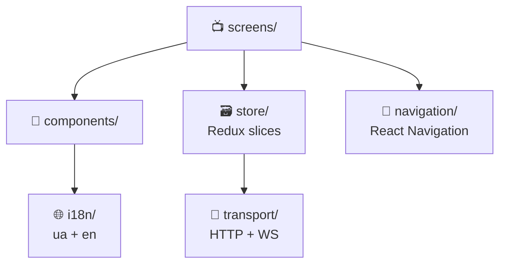

# 📱 Mobile Architecture

Expo / React Native app. Uses NativeWind (Tailwind in RN), Redux Toolkit, i18next.

[Source ↗](https://github.com/alphaoflogic-ua/smart-home-mobile)

## Layout



## State Management

Same Redux pattern as Station Frontend — slices have only sync reducers, thunks dispatch lifecycle actions explicitly. See [Station Frontend → Redux](/station/frontend/redux) for the full pattern.

## Styling

- **NativeWind** (Tailwind classes for RN) — not styled-components
- Same semantic color tokens as Station Frontend
- `useTranslation()` for all user-facing strings

## API Client

```typescript
// transport/http/client.ts
const apiClient = axios.create({
  baseURL: CLOUD_HOST,
  // auth interceptors + token refresh
});
```

All API calls go through thunks in `*.actions.ts` files. Screens never import from `transport/`.

## WebSocket

Mobile keeps a WSS connection to Cloud for real-time device state updates and push fallbacks.

## Reference

- Conventions: [expo.md ↗](https://github.com/alphaoflogic-ua/smart-home-mobile/blob/main/.claude/rules/expo.md)
