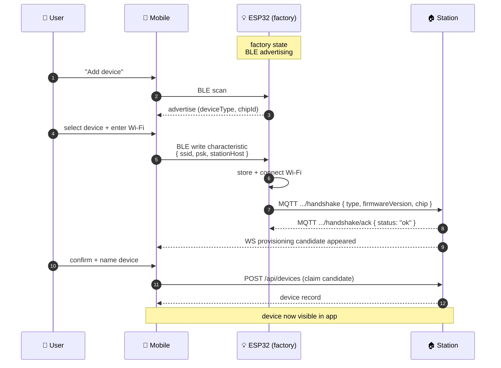

# 🔵 BLE Provisioning

Adding a new ESP32 device. Mobile uses Bluetooth LE to send Wi-Fi credentials directly to the device.

## Sequence {#sequence}

## On the Backend Side

Provisioning flow goes through `device-bootstrap/` module:

- `bleBridge.ts` — Node wrapper around Python `bleak` (`packages/backend/scripts/ble_bridge.py`)
- `bleProvisionService.ts` — scan/provision business logic
- `provisioningManager.ts` — tracks WS-connected candidates

[Source ↗](https://github.com/alphaoflogic-ua/smart-home/tree/develop/packages/backend/src/modules/device-bootstrap)

:::note Why Python for BLE?
`bleak` is the most reliable cross-platform BLE library; Node BLE bindings have rough edges on Linux. The Node side spawns Python as a child process and exchanges JSON over stdin/stdout. **All business logic stays in Node.**
:::

## Reference

- [ESP32 BLE provisioning (NimBLE) ↗](https://github.com/alphaoflogic-ua/smart-home/tree/develop/firmware/lib/smart-home-core)
