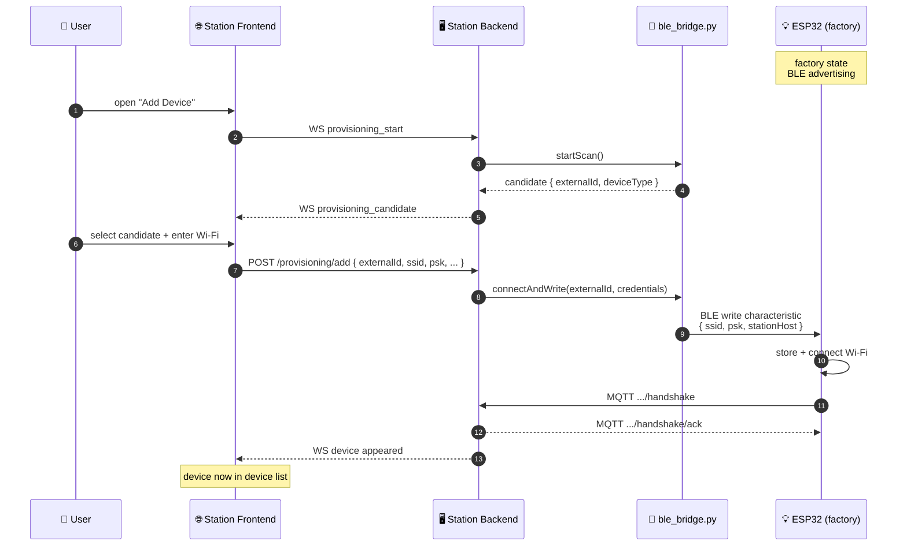

# 📲 Device Provisioning

The mobile app does **not** do BLE directly. BLE provisioning is handled by the **Station backend (RPi)** via Python bleak — the mobile app's role is limited to the Station Frontend web UI or receiving WS notifications.

## Actual Flow {#sequence}

## Backend Modules

- `bleBridge.ts` — spawns Python subprocess, exposes `startScan()` / `connectAndWrite()`
- `bleProvisionService.ts` — orchestrates scan → provision
- `provisioningManager.ts` — broadcasts candidates via WS to all connected clients

[Source ↗](https://github.com/alphaoflogic-ua/smart-home/tree/develop/packages/backend/src/modules/device-bootstrap)

:::note Why Python for BLE?
`bleak` is the most reliable BLE library on Linux. The RPi runs Python as a child process and exchanges JSON over stdin/stdout. All business logic stays in Node.
:::

## Mobile App Role

Mobile app has **no BLE libraries** and no provisioning screen. New devices are added via the Station local web UI (`smartstation.local`) which is the Station Frontend SPA.

## Reference

- [ESP32 BLE (NimBLE) ↗](https://github.com/alphaoflogic-ua/smart-home/tree/develop/firmware/lib/smart-home-core)
- [device-bootstrap module ↗](https://github.com/alphaoflogic-ua/smart-home/tree/develop/packages/backend/src/modules/device-bootstrap)
