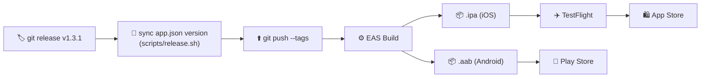

# 🚀 Mobile Deployment

## Version Sync

`scripts/release.sh` keeps `package.json` and `app.json` (`expo.version`) in sync — EAS Build refuses to publish if they differ.

## TestFlight Checklist

See full checklist in [TESTFLIGHT_DEPLOYMENT_CHECKLIST.md ↗](https://github.com/alphaoflogic-ua/smart-home-mobile/blob/main/docs/TESTFLIGHT_DEPLOYMENT_CHECKLIST.md).

## Reference

- [eas.json ↗](https://github.com/alphaoflogic-ua/smart-home-mobile/blob/main/eas.json)
- [APPSTORE_PLAN.md ↗](https://github.com/alphaoflogic-ua/smart-home-mobile/blob/main/APPSTORE_PLAN.md)
