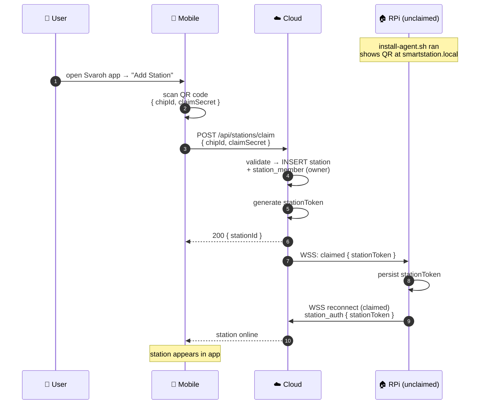

# 🎯 Station Claiming

The mobile app is the primary tool for claiming a Raspberry Pi station and binding it to a user account.

## Flow {#flow}

## What Mobile Does

- Scans the QR code shown at `http://smartstation.local` (or station's local IP)
- QR encodes `chipId` + `claimSecret` generated by `install-agent.sh`
- Sends claim request to Cloud — Cloud does the validation and token issuance
- After claim, mobile receives the station and can control devices remotely via Cloud relay

## Inviting Other Members

After claiming, the owner can invite other users via the Station Frontend or mobile:

1. Enter email + role (`admin` / `member`)
2. Station queues the invite (works offline)
3. When online — Cloud sends email with registration link
4. New user registers → Cloud syncs identity to Station

## Reference

- [Cloud: Station Claiming](/cloud/claiming) — server-side flow
- [Cloud: Authentication](/cloud/auth#cache) — identity cache on Station
