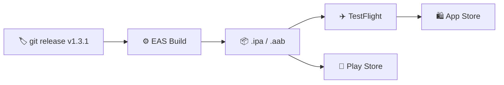

# 📱 Mobile Deployment

[Link to source repo ↗](https://github.com/alphaoflogic-ua/smart-home-mobile)

## Pipeline



Цель: выпустить `smart-home-mobile` в TestFlight как internal + public beta, чтобы тестировать на реальных iPhone с реальным cloud-сервисом.

**После первоначальной настройки** деплой = `git push main`. GitHub Actions автоматически билдит и отправляет в TestFlight.

**Ориентир по времени:** ~2 часа one-time setup + 24–72 часа ожидания Apple.
**Стартовый бюджет:** ~$99 (Apple Developer Program на год).

---

## Stage 0. Предусловия

- [ ] 0.1. Mac с Xcode (или доступ к EAS cloud-билдам — можно без Mac).
- [ ] 0.2. iPhone для тестирования (iOS 15+).
- [ ] 0.3. Apple ID (https://appleid.apple.com, бесплатно).
- [ ] 0.4. Международная карта (Visa/MC, Wise/Monobank FX).
- [ ] 0.5. Node 20+: `node --version`.
- [ ] 0.6. **Cloud staging уже задеплоен** (см. `smart-home-cloud/docs/STAGING_DEPLOYMENT_CHECKLIST.md`) — нужен URL типа `https://api.staging.<DOMAIN>`.

---

## Stage 1. Apple Developer Program (30 мин + 24–72ч ожидания)

- [ ] 1.1. Войти на https://developer.apple.com/account с Apple ID.
- [ ] 1.2. Включить **двухфакторку** на Apple ID — https://appleid.apple.com → _Sign-In and Security_.
- [ ] 1.3. https://developer.apple.com/programs/enroll/ → _Start Your Enrollment_.
- [ ] 1.4. Выбрать **Individual / Sole Proprietor** (НЕ Organization — требует D-U-N-S).
- [ ] 1.5. Заполнить: имя латиницей как в документе, адрес, телефон.
- [ ] 1.6. Оплатить $99. Ожидание — 24–48ч, иногда до 7 дней.
- [ ] 1.7. После одобрения: https://developer.apple.com/account → статус _Active_.

**⚠️ Пока ждёшь — продолжай Stage 2–4 параллельно.**

**Проверка:** на developer.apple.com/account видно "Apple Developer Program — Enrolled".

---

## Stage 2. EAS Setup (15 мин)

- [ ] 2.1. Установить EAS CLI:
  ```bash
  npm install -g eas-cli
  eas --version  # >= 14.x
  ```
- [ ] 2.2. Зарегистрироваться на https://expo.dev (бесплатно).
- [ ] 2.3. Залогиниться:
  ```bash
  cd /Users/andrejprudnikov/WebstormProjects/smart-home-mobile
  eas login
  eas whoami
  ```
- [ ] 2.4. Инициализировать проект:
  ```bash
  eas init
  ```
- [ ] 2.5. Синхронизировать `version` в `package.json` и `app.json` → обе `"1.0.0"`.
- [ ] 2.6. В `app.json` добавить `ios.buildNumber`:
  ```json
  "ios": {
    "supportsTablet": true,
    "bundleIdentifier": "com.andriiprudnikov.smarthomemobile",
    "buildNumber": "1"
  }
  ```
- [ ] 2.7. Создать `eas.json` (см. шаблон в конце файла).
- [ ] 2.8. Настроить OTA-обновления:
  ```bash
  eas update:configure
  ```
  Добавит `runtimeVersion` в `app.json`.

**Проверка:** `eas build:configure` проходит без ошибок.

---

## Stage 3. Env и Assets (15 мин)

### Переменные окружения

- [ ] 3.1. В `app.json` добавить блок `extra`:
  ```json
  "extra": {
    "cloudApiUrl": "http://localhost:4000",
    "cloudWssUrl": "ws://localhost:4000/ws"
  }
  ```
- [ ] 3.2. Создать/обновить `src/shared/config.ts`:

  ```typescript
  import Constants from 'expo-constants';

  const fallback = Constants.expoConfig?.extra ?? {};

  export const config = {
    cloudApiUrl: process.env.EXPO_PUBLIC_CLOUD_API_URL ?? fallback.cloudApiUrl,
    cloudWssUrl: process.env.EXPO_PUBLIC_CLOUD_WSS_URL ?? fallback.cloudWssUrl,
  };
  ```

- [ ] 3.3. Проверить что `transport/http/client.ts` и WS клиент читают `config.cloudApiUrl` / `config.cloudWssUrl`, а не хардкодят URL.

### Assets

- [ ] 3.4. `assets/icon.png` — **1024×1024 PNG без прозрачности** (Apple отклонит если есть alpha).
- [ ] 3.5. `assets/splash-icon.png` — ≥1242×1242.
- [ ] 3.6. `assets/adaptive-icon.png` — 1024×1024 (Android).
- [ ] 3.7. Проверка alpha:
  ```bash
  sips -g hasAlpha assets/icon.png
  # hasAlpha: no  ← должно быть
  ```

---

## Stage 4. App Store Connect (25 мин, после одобрения Apple Dev)

**⚠️ Только после того как Apple Dev Enrollment в статусе Active.**

### App Record

- [ ] 4.1. https://appstoreconnect.apple.com → _My Apps_ → "+" → _New App_.
- [ ] 4.2. Заполнить:
  - Platforms: **iOS**
  - Name: `Smart Home`
  - Primary Language: **English (U.S.)** или **Ukrainian**
  - Bundle ID: `com.andriiprudnikov.smarthomemobile` (если нет — зарегистрировать на https://developer.apple.com/account/resources/identifiers/list)
  - SKU: `smart-home-mobile-001`
  - User Access: Full Access
- [ ] 4.3. _Create_. Запомнить **числовой Apple ID** (URL или App Information → Apple ID).

### API Key (для автоматического submit)

- [ ] 4.4. _Users and Access_ → _Integrations_ → _App Store Connect API_ → _Team Keys_ → "+".
- [ ] 4.5. Name: `EAS Submit`, Access: **App Manager**.
- [ ] 4.6. Скачать `.p8` файл (**один раз!**) → сохранить в `~/Documents/smart-home-asc-key.p8` (НЕ в репо!).
- [ ] 4.7. Записать **Issuer ID** и **Key ID**.
- [ ] 4.8. Заполнить `eas.json` → `submit.production.ios` реальными значениями (ascAppId, appleTeamId, ascApiKeyIssuerId, ascApiKeyId).

---

## Stage 5. CI/CD — GitHub Actions (15 мин)

### Secrets

- [ ] 5.1. Создать Expo token: https://expo.dev → Account Settings → Access Tokens → Create.
- [ ] 5.2. В GitHub репозитории → Settings → Secrets and variables → Actions → добавить:
  - `EXPO_TOKEN` — токен из 5.1

### Workflow: TestFlight Deploy (push to main)

- [ ] 5.3. Создать `.github/workflows/testflight.yml`:

  ```yaml
  name: TestFlight Deploy

  on:
    push:
      branches: [main]

  jobs:
    build-and-submit:
      name: Build & Submit to TestFlight
      runs-on: ubuntu-latest
      steps:
        - uses: actions/checkout@v4

        - uses: actions/setup-node@v4
          with:
            node-version: 20
            cache: npm

        - run: npm ci

        - uses: expo/expo-github-action@v8
          with:
            eas-version: latest
            token: ${{ secrets.EXPO_TOKEN }}

        - name: Build and auto-submit
          run: eas build --profile production --platform ios --non-interactive --auto-submit
  ```

### Workflow: OTA Update (JS-only changes)

- [ ] 5.4. Создать `.github/workflows/ota-update.yml`:

  ```yaml
  name: OTA Update

  on:
    workflow_dispatch:
      inputs:
        message:
          description: Update message
          required: true
        branch:
          description: EAS branch
          required: true
          default: production

  jobs:
    update:
      name: Push OTA Update
      runs-on: ubuntu-latest
      steps:
        - uses: actions/checkout@v4

        - uses: actions/setup-node@v4
          with:
            node-version: 20
            cache: npm

        - run: npm ci

        - uses: expo/expo-github-action@v8
          with:
            eas-version: latest
            token: ${{ secrets.EXPO_TOKEN }}

        - run: eas update --branch ${{ inputs.branch }} --message "${{ inputs.message }}"
  ```

---

## Stage 6. Первый билд (one-time, ручной)

Первый раз нужно запустить вручную — EAS спросит про credentials.

- [ ] 6.1. Проверить staging: `curl https://api.staging.<DOMAIN>/health` → 200.
- [ ] 6.2. Запустить:
  ```bash
  eas build --profile production --platform ios --auto-submit
  ```
- [ ] 6.3. EAS спросит про credentials — _Let EAS handle it_:
  - Distribution Certificate: create new
  - Provisioning Profile: create new
  - Push Key: skip (если не используешь push)
- [ ] 6.4. Ждать билд (15–60 мин в free tier). Прогресс: https://expo.dev → Builds.
- [ ] 6.5. Билд автоматически уйдёт в TestFlight. В App Store Connect → TestFlight → _Builds_ — статус _Processing_ → _Ready to Test_.
- [ ] 6.6. Если _Missing Compliance_ — кликнуть → _Encryption_ → ответить что НЕ используешь нестандартную криптографию.

**Troubleshooting:**

- **"Invalid bundle identifier"** — bundle ID в `app.json` не совпадает с зарегистрированным в Stage 4.
- **"No profiles matching"** — перезапусти `eas build` и переделай credentials.

---

## Stage 7. Testing и Public Beta (20 мин)

### Internal testing

- [ ] 7.1. App Store Connect → TestFlight → _Internal Testing_ → _App Store Connect Users_ → добавить свой email.
- [ ] 7.2. На iPhone установить **TestFlight** из App Store.
- [ ] 7.3. Открыть invite → Install → проверить:
  - Приложение открывается
  - Scan QR работает
  - Запросы идут на `api.staging.<DOMAIN>`

### Public beta

- [ ] 7.4. TestFlight → _External Testing_ → _Add New Group_ → `Public Beta`.
- [ ] 7.5. _Add Build_ → выбрать билд.
- [ ] 7.6. Заполнить Test Information (What to Test, Email).
- [ ] 7.7. Apple запросит **Beta App Review** (24–48ч).
- [ ] 7.8. После одобрения — включить _Public Link_ → скопировать `https://testflight.apple.com/join/XXXXXXXX`.

---

## Повседневный workflow (после setup)

### Полный релиз (native-изменения)

```
git push main  →  GitHub Actions  →  EAS Build  →  auto-submit  →  TestFlight
```

Ничего делать не нужно. Через ~30–40 мин билд появится в TestFlight.

### OTA-обновление (JS-only изменения, без ре-билда)

GitHub → Actions → _OTA Update_ → Run workflow → ввести message.

Тестеры получат обновление при следующем запуске приложения — мимо App Store.

**Когда OTA, а когда полный билд?**

- OTA: UI-правки, баг-фиксы в JS, изменения стилей, новые экраны
- Полный билд: новые native-модули, обновление Expo SDK, изменения `app.json`

---

## Шаблон: `eas.json`

```json
{
  "cli": {
    "version": ">= 14.0.0",
    "appVersionSource": "remote"
  },
  "build": {
    "development": {
      "developmentClient": true,
      "distribution": "internal",
      "ios": {
        "simulator": true
      }
    },
    "preview": {
      "distribution": "internal",
      "autoIncrement": "buildNumber",
      "channel": "preview",
      "env": {
        "EXPO_PUBLIC_CLOUD_API_URL": "https://api.staging.<DOMAIN>",
        "EXPO_PUBLIC_CLOUD_WSS_URL": "wss://api.staging.<DOMAIN>/ws"
      },
      "ios": {
        "resourceClass": "m-medium"
      }
    },
    "production": {
      "autoIncrement": "buildNumber",
      "channel": "production",
      "env": {
        "EXPO_PUBLIC_CLOUD_API_URL": "https://api.<DOMAIN>",
        "EXPO_PUBLIC_CLOUD_WSS_URL": "wss://api.<DOMAIN>/ws"
      },
      "ios": {
        "resourceClass": "m-medium"
      }
    }
  },
  "submit": {
    "production": {
      "ios": {
        "ascAppId": "<числовой App ID из ASC>",
        "appleTeamId": "<Team ID из developer.apple.com/account>",
        "ascApiKeyPath": "/Users/andrejprudnikov/Documents/smart-home-asc-key.p8",
        "ascApiKeyIssuerId": "<Issuer ID>",
        "ascApiKeyId": "<Key ID>"
      }
    }
  }
}
```

---

## Итоговая проверка

- [ ] Apple Developer Program активен
- [ ] App record в App Store Connect создан
- [ ] GitHub Actions workflow закоммичен
- [ ] `EXPO_TOKEN` добавлен в GitHub Secrets
- [ ] Первый ручной билд прошёл, credentials в EAS
- [ ] Билд в TestFlight со статусом _Ready to Test_
- [ ] Приложение работает на iPhone через TestFlight
- [ ] Beta App Review пройден, public link активен
- [ ] Push в `main` → автоматический билд → TestFlight
