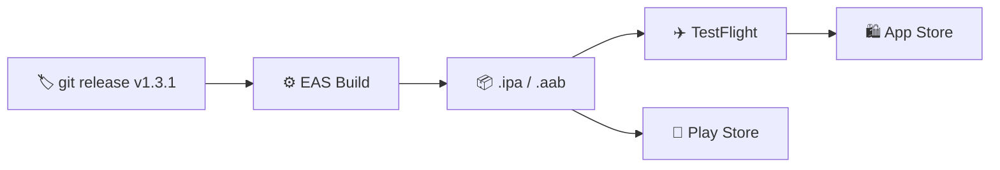

# 📱 Mobile Deployment

[Link to source repo ↗](https://github.com/alphaoflogic-ua/smart-home-mobile)

## Pipeline



Goal: ship `smart-home-mobile` to TestFlight as internal + public beta so it can be tested on real iPhones against the real cloud service.

**After the initial setup**, deployment is just `git push main`. GitHub Actions automatically builds and submits to TestFlight.

**Time estimate:** ~2 hours of one-time setup + 24–72 hours waiting on Apple.
**Initial budget:** ~$99 (Apple Developer Program, annual).

---

## Stage 0. Prerequisites

- [ ] 0.1. Mac with Xcode (or access to EAS cloud builds — Mac is optional in that case).
- [ ] 0.2. iPhone for testing (iOS 15+).
- [ ] 0.3. Apple ID (https://appleid.apple.com, free).
- [ ] 0.4. International card (Visa/MC, Wise/Monobank FX).
- [ ] 0.5. Node 20+: `node --version`.
- [ ] 0.6. **Cloud staging already deployed** (see `smart-home-cloud/docs/STAGING_DEPLOYMENT_CHECKLIST.md`) — you'll need a URL like `https://api.staging.<DOMAIN>`.

---

## Stage 1. Apple Developer Program (30 min + 24–72h wait)

- [ ] 1.1. Sign in to https://developer.apple.com/account with your Apple ID.
- [ ] 1.2. Enable **two-factor auth** on your Apple ID — https://appleid.apple.com → _Sign-In and Security_.
- [ ] 1.3. https://developer.apple.com/programs/enroll/ → _Start Your Enrollment_.
- [ ] 1.4. Choose **Individual / Sole Proprietor** (NOT Organization — that requires a D-U-N-S number).
- [ ] 1.5. Fill in: name in Latin script as on your ID document, address, phone.
- [ ] 1.6. Pay $99. Wait — 24–48h, sometimes up to 7 days.
- [ ] 1.7. Once approved: https://developer.apple.com/account → status _Active_.

**⚠️ While you wait — proceed with Stage 2–4 in parallel.**

**Verification:** developer.apple.com/account shows "Apple Developer Program — Enrolled".

---

## Stage 2. EAS Setup (15 min)

- [ ] 2.1. Install EAS CLI:
  ```bash
  npm install -g eas-cli
  eas --version  # >= 14.x
  ```
- [ ] 2.2. Sign up at https://expo.dev (free).
- [ ] 2.3. Log in:
  ```bash
  cd /Users/andrejprudnikov/WebstormProjects/smart-home-mobile
  eas login
  eas whoami
  ```
- [ ] 2.4. Initialize the project:
  ```bash
  eas init
  ```
- [ ] 2.5. Sync `version` between `package.json` and `app.json` → both `"1.0.0"`.
- [ ] 2.6. In `app.json` add `ios.buildNumber`:
  ```json
  "ios": {
    "supportsTablet": true,
    "bundleIdentifier": "com.andriiprudnikov.smarthomemobile",
    "buildNumber": "1"
  }
  ```
- [ ] 2.7. Create `eas.json` (see template at the end of this file).
- [ ] 2.8. Configure OTA updates:
  ```bash
  eas update:configure
  ```
  This adds `runtimeVersion` to `app.json`.

**Verification:** `eas build:configure` runs without errors.

---

## Stage 3. Env and Assets (15 min)

### Environment variables

- [ ] 3.1. In `app.json` add an `extra` block:
  ```json
  "extra": {
    "cloudApiUrl": "http://localhost:4000",
    "cloudWssUrl": "ws://localhost:4000/ws"
  }
  ```
- [ ] 3.2. Create/update `src/shared/config.ts`:

  ```typescript
  import Constants from 'expo-constants';

  const fallback = Constants.expoConfig?.extra ?? {};

  export const config = {
    cloudApiUrl: process.env.EXPO_PUBLIC_CLOUD_API_URL ?? fallback.cloudApiUrl,
    cloudWssUrl: process.env.EXPO_PUBLIC_CLOUD_WSS_URL ?? fallback.cloudWssUrl,
  };
  ```

- [ ] 3.3. Confirm `transport/http/client.ts` and the WS client read `config.cloudApiUrl` / `config.cloudWssUrl` instead of hardcoding URLs.

### Assets

- [ ] 3.4. `assets/icon.png` — **1024×1024 PNG, no transparency** (Apple rejects builds with an alpha channel).
- [ ] 3.5. `assets/splash-icon.png` — ≥1242×1242.
- [ ] 3.6. `assets/adaptive-icon.png` — 1024×1024 (Android).
- [ ] 3.7. Alpha check:
  ```bash
  sips -g hasAlpha assets/icon.png
  # hasAlpha: no  ← expected
  ```

---

## Stage 4. App Store Connect (25 min, after Apple Dev approval)

**⚠️ Only after Apple Dev Enrollment is in Active state.**

### App Record

- [ ] 4.1. https://appstoreconnect.apple.com → _My Apps_ → "+" → _New App_.
- [ ] 4.2. Fill in:
  - Platforms: **iOS**
  - Name: `Smart Home`
  - Primary Language: **English (U.S.)** or **Ukrainian**
  - Bundle ID: `com.andriiprudnikov.smarthomemobile` (if missing — register it at https://developer.apple.com/account/resources/identifiers/list)
  - SKU: `smart-home-mobile-001`
  - User Access: Full Access
- [ ] 4.3. _Create_. Note down the **numeric Apple ID** (URL or App Information → Apple ID).

### API Key (for automated submit)

- [ ] 4.4. _Users and Access_ → _Integrations_ → _App Store Connect API_ → _Team Keys_ → "+".
- [ ] 4.5. Name: `EAS Submit`, Access: **App Manager**.
- [ ] 4.6. Download the `.p8` file (**only once!**) → save to `~/Documents/smart-home-asc-key.p8` (NOT in the repo!).
- [ ] 4.7. Record the **Issuer ID** and **Key ID**.
- [ ] 4.8. Fill in `eas.json` → `submit.production.ios` with the real values (ascAppId, appleTeamId, ascApiKeyIssuerId, ascApiKeyId).

---

## Stage 5. CI/CD — GitHub Actions (15 min)

### Secrets

- [ ] 5.1. Create an Expo token: https://expo.dev → Account Settings → Access Tokens → Create.
- [ ] 5.2. In the GitHub repo → Settings → Secrets and variables → Actions → add:
  - `EXPO_TOKEN` — token from 5.1

### Workflow: TestFlight Deploy (push to main)

- [ ] 5.3. Create `.github/workflows/testflight.yml`:

  ```yaml
  name: TestFlight Deploy

  on:
    push:
      branches: [main]

  jobs:
    build-and-submit:
      name: Build & Submit to TestFlight
      runs-on: ubuntu-latest
      steps:
        - uses: actions/checkout@v4

        - uses: actions/setup-node@v4
          with:
            node-version: 20
            cache: npm

        - run: npm ci

        - uses: expo/expo-github-action@v8
          with:
            eas-version: latest
            token: ${{ secrets.EXPO_TOKEN }}

        - name: Build and auto-submit
          run: eas build --profile production --platform ios --non-interactive --auto-submit
  ```

### Workflow: OTA Update (JS-only changes)

- [ ] 5.4. Create `.github/workflows/ota-update.yml`:

  ```yaml
  name: OTA Update

  on:
    workflow_dispatch:
      inputs:
        message:
          description: Update message
          required: true
        branch:
          description: EAS branch
          required: true
          default: production

  jobs:
    update:
      name: Push OTA Update
      runs-on: ubuntu-latest
      steps:
        - uses: actions/checkout@v4

        - uses: actions/setup-node@v4
          with:
            node-version: 20
            cache: npm

        - run: npm ci

        - uses: expo/expo-github-action@v8
          with:
            eas-version: latest
            token: ${{ secrets.EXPO_TOKEN }}

        - run: eas update --branch ${{ inputs.branch }} --message "${{ inputs.message }}"
  ```

---

## Stage 6. First build (one-time, manual)

The first build has to be triggered manually — EAS will prompt for credentials.

- [ ] 6.1. Verify staging: `curl https://api.staging.<DOMAIN>/health` → 200.
- [ ] 6.2. Run:
  ```bash
  eas build --profile production --platform ios --auto-submit
  ```
- [ ] 6.3. EAS will ask about credentials — _Let EAS handle it_:
  - Distribution Certificate: create new
  - Provisioning Profile: create new
  - Push Key: skip (if you don't use push)
- [ ] 6.4. Wait for the build (15–60 min on the free tier). Progress: https://expo.dev → Builds.
- [ ] 6.5. The build is automatically submitted to TestFlight. In App Store Connect → TestFlight → _Builds_ — status _Processing_ → _Ready to Test_.
- [ ] 6.6. If you see _Missing Compliance_ — click it → _Encryption_ → answer that you do NOT use non-standard cryptography.

**Troubleshooting:**

- **"Invalid bundle identifier"** — the bundle ID in `app.json` doesn't match the one registered in Stage 4.
- **"No profiles matching"** — re-run `eas build` and recreate credentials.

---

## Stage 7. Testing and Public Beta (20 min)

### Internal testing

- [ ] 7.1. App Store Connect → TestFlight → _Internal Testing_ → _App Store Connect Users_ → add your own email.
- [ ] 7.2. Install **TestFlight** from the App Store on your iPhone.
- [ ] 7.3. Open the invite → Install → verify:
  - The app launches
  - Scan QR works
  - Requests go to `api.staging.<DOMAIN>`

### Public beta

- [ ] 7.4. TestFlight → _External Testing_ → _Add New Group_ → `Public Beta`.
- [ ] 7.5. _Add Build_ → pick the build.
- [ ] 7.6. Fill in Test Information (What to Test, Email).
- [ ] 7.7. Apple will request a **Beta App Review** (24–48h).
- [ ] 7.8. Once approved — enable _Public Link_ → copy `https://testflight.apple.com/join/XXXXXXXX`.

---

## Day-to-day workflow (after setup)

### Full release (native changes)

```
git push main  →  GitHub Actions  →  EAS Build  →  auto-submit  →  TestFlight
```

Nothing to do. The build shows up in TestFlight in ~30–40 min.

### OTA update (JS-only changes, no rebuild)

GitHub → Actions → _OTA Update_ → Run workflow → enter a message.

Testers receive the update on the next app launch — bypassing the App Store.

**When OTA vs full build?**

- OTA: UI tweaks, JS bug fixes, style changes, new screens
- Full build: new native modules, Expo SDK upgrade, `app.json` changes

---

## Template: `eas.json`

```json
{
  "cli": {
    "version": ">= 14.0.0",
    "appVersionSource": "remote"
  },
  "build": {
    "development": {
      "developmentClient": true,
      "distribution": "internal",
      "ios": {
        "simulator": true
      }
    },
    "preview": {
      "distribution": "internal",
      "autoIncrement": "buildNumber",
      "channel": "preview",
      "env": {
        "EXPO_PUBLIC_CLOUD_API_URL": "https://api.staging.<DOMAIN>",
        "EXPO_PUBLIC_CLOUD_WSS_URL": "wss://api.staging.<DOMAIN>/ws"
      },
      "ios": {
        "resourceClass": "m-medium"
      }
    },
    "production": {
      "autoIncrement": "buildNumber",
      "channel": "production",
      "env": {
        "EXPO_PUBLIC_CLOUD_API_URL": "https://api.<DOMAIN>",
        "EXPO_PUBLIC_CLOUD_WSS_URL": "wss://api.<DOMAIN>/ws"
      },
      "ios": {
        "resourceClass": "m-medium"
      }
    }
  },
  "submit": {
    "production": {
      "ios": {
        "ascAppId": "<numeric App ID from ASC>",
        "appleTeamId": "<Team ID from developer.apple.com/account>",
        "ascApiKeyPath": "/Users/andrejprudnikov/Documents/smart-home-asc-key.p8",
        "ascApiKeyIssuerId": "<Issuer ID>",
        "ascApiKeyId": "<Key ID>"
      }
    }
  }
}
```

---

## Final checklist

- [ ] Apple Developer Program is active
- [ ] App record created in App Store Connect
- [ ] GitHub Actions workflow committed
- [ ] `EXPO_TOKEN` added to GitHub Secrets
- [ ] First manual build succeeded, credentials stored in EAS
- [ ] Build in TestFlight with status _Ready to Test_
- [ ] App runs on iPhone via TestFlight
- [ ] Beta App Review passed, public link active
- [ ] Push to `main` → automatic build → TestFlight
