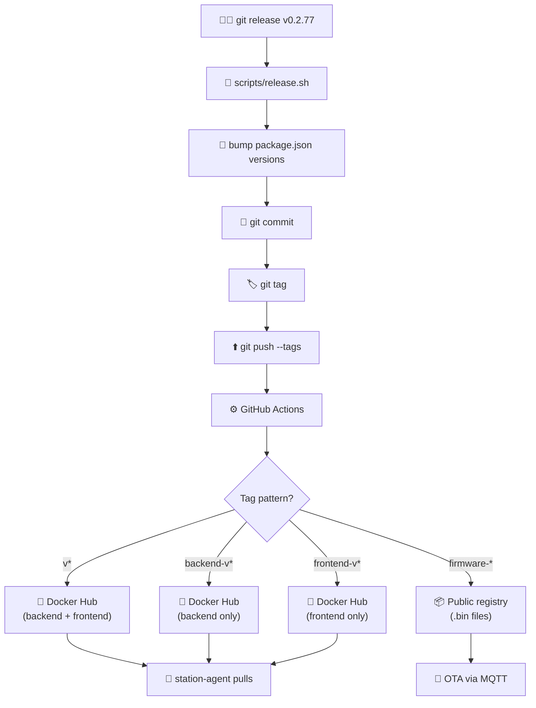

# 🚀 Release Flow

All repos use a unified release script: `git release <tag>` (alias for `scripts/release.sh`). **Never edit `package.json` versions or create tags manually.**

## Pipeline

## Tag Patterns by Repo

| Repo | Tag examples | What gets built |
|---|---|---|
| [`smart-home`](https://github.com/alphaoflogic-ua/smart-home) | `v0.2.77`, `backend-v...`, `frontend-v...`, `firmware-esp32-climate-v...` | Docker Hub (app) / public registry (firmware) |
| [`smart-home-cloud`](https://github.com/alphaoflogic-ua/smart-home-cloud) | `v0.2.1` | Cloud deploy |
| [`smart-home-mobile`](https://github.com/alphaoflogic-ua/smart-home-mobile) | `v1.3.1` | EAS build (TestFlight) |

## Default Branches & Jira Prefixes

| Repo | Branch | Jira |
|---|---|---|
| `smart-home` | `develop` | `SHS-` |
| `smart-home-cloud` | `develop` | `SHC-` |
| `smart-home-mobile` | `main` | `SHM-` |

The Jira prefix is **mandatory** in commit messages: `SHC-63 add password reset`.

## Mobile Caveat

For `smart-home-mobile`, `release.sh` syncs `package.json` ↔ `app.json` (`expo.version`) before tagging — they must match for EAS Build to accept the version.
