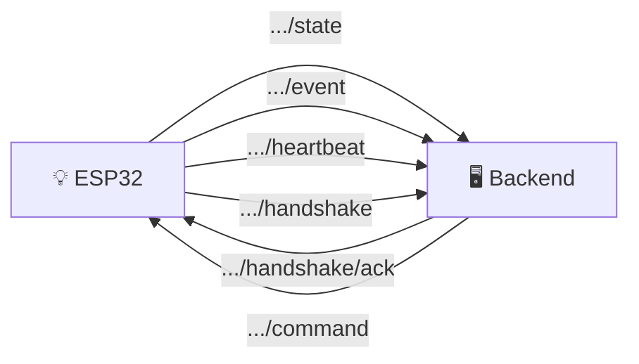
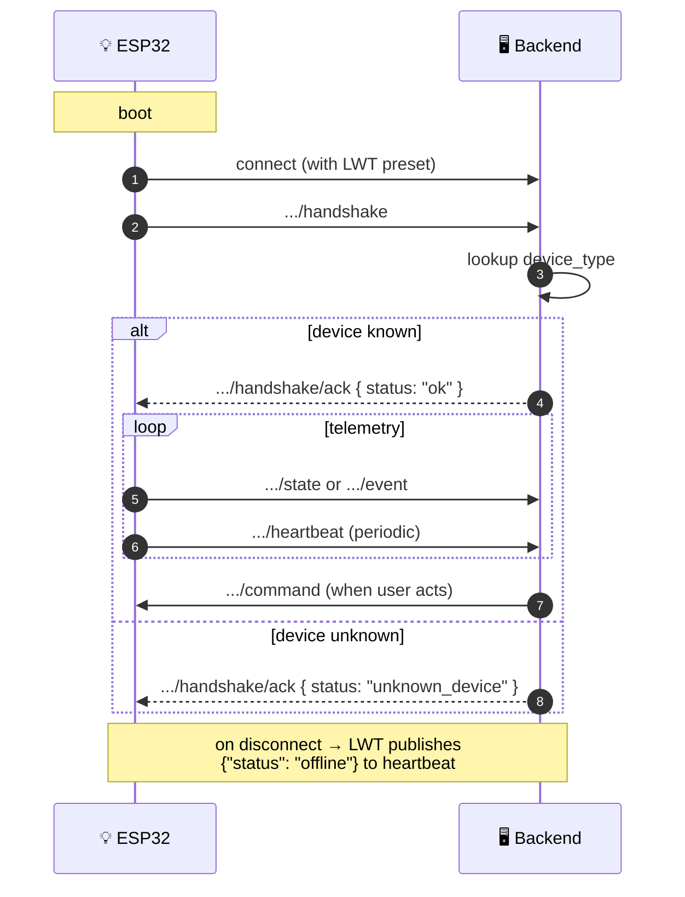

# 📡 MQTT Protocol

The Station's backend runs an MQTT broker. ESP32 devices connect to it for telemetry and commands.

## Topic Map {#topics}



## Topic Reference

All topics are scoped: `station/{stationId}/device/{deviceId}/<suffix>`.

| Direction | Topic | Payload |
|---|---|---|
| Device → Backend | `.../state` | `{"state": {...}}` |
| Device → Backend | `.../event` | `{"event": "device_event"\|"user_event", "data": {"action":"..."}}` |
| Device → Backend | `.../heartbeat` | `{"status": "online"}` (auto by SmartHomeCore) |
| Device → Backend | `.../handshake` | `{"type":"...","firmwareVersion":"...","chip":"..."}` |
| Backend → Device | `.../handshake/ack` | `{"status":"ok"}` or `{"status":"unknown_device"}` |
| Backend → Device | `.../command` | `{"action":"...", ...}` |

## Payloads {#payloads}

### State

`{"state": { ... }}` — JSON object with sensor/actuator values. Keys match capability names from the [Device Type Registry](/firmware/device-types).

### Event

```json
{"event": "device_event", "data": {"action": "motion_detected"}}
{"event": "user_event",   "data": {"action": "button_press"}}
```

### Command

```json
{"action": "toggle"}
{"action": "set_brightness", "brightness": 75}
```

Built-in commands (handled by SmartHomeCore): `reboot`, `factory_reset`, `ota_update`.

## Lifecycle {#lifecycle}



## LWT (Last Will and Testament) {#lwt}

`SmartHomeCore` sets LWT on MQTT connect — publishes `{"status":"offline"}` to the heartbeat topic on unexpected disconnect, so Backend can mark the device offline immediately.

## Reference

- [Source: backend MQTT module](https://github.com/alphaoflogic-ua/smart-home/tree/develop/packages/backend/src/modules/device-core/adapters)
- [Source: SmartHomeCore](https://github.com/alphaoflogic-ua/smart-home/tree/develop/firmware/lib/smart-home-core)
