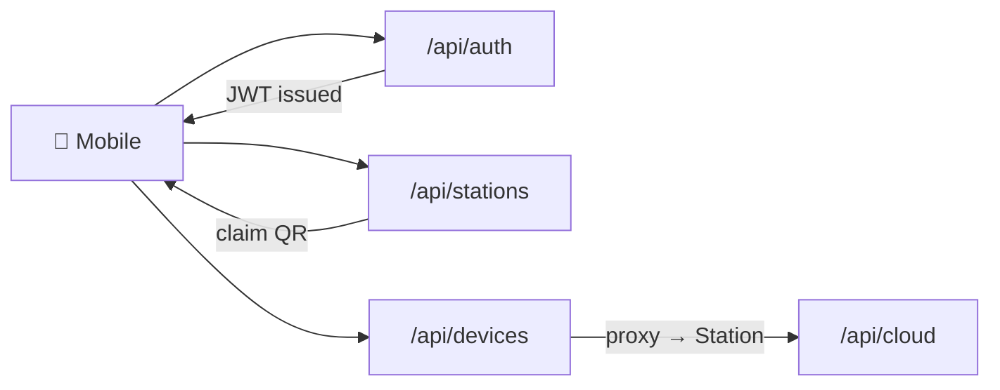

# 🌐 REST API

The Cloud HTTP API. Documented inline via OpenAPI — every route declares a Zod `schema` block consumed by `@fastify/swagger` + `fastify-type-provider-zod`.

## Live Documentation

- **Scalar UI:** `<cloud-host>/api/reference`
- **OpenAPI JSON:** `<cloud-host>/documentation/json`

## Endpoint Groups

| Module | Prefix | Owns |
|---|---|---|
| `auth` | `/api/auth` | registration, login, OAuth, JWT, password reset |
| `stations` | `/api/stations` | claim, members, invites, identity sync |
| `devices` | `/api/devices` | proxy to Station via `peer.call()` (no local data) |

## Conventions

- **All Zod schemas use `camelCase` keys**
- Error response: `ErrorSchema` from `shared/schemas.ts` → `{ statusCode, error, message }`
- `Authorization: Bearer <accessToken>` on protected routes
- Refresh tokens via `POST /api/auth/refresh`

## Reference

- [Source: cloud routes](https://github.com/alphaoflogic-ua/smart-home-cloud/tree/develop/src/modules)
- [Source: shared schemas](https://github.com/alphaoflogic-ua/smart-home-cloud/blob/develop/src/shared/schemas.ts)
- [Cloud spec doc ↗](https://github.com/alphaoflogic-ua/smart-home-cloud/blob/develop/docs/cloud-spec.md)
