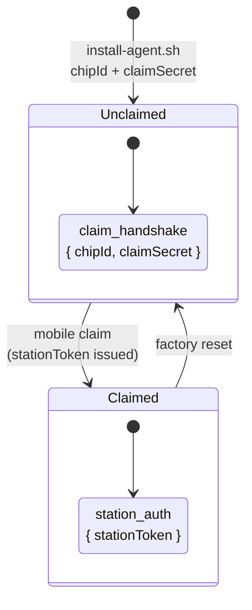
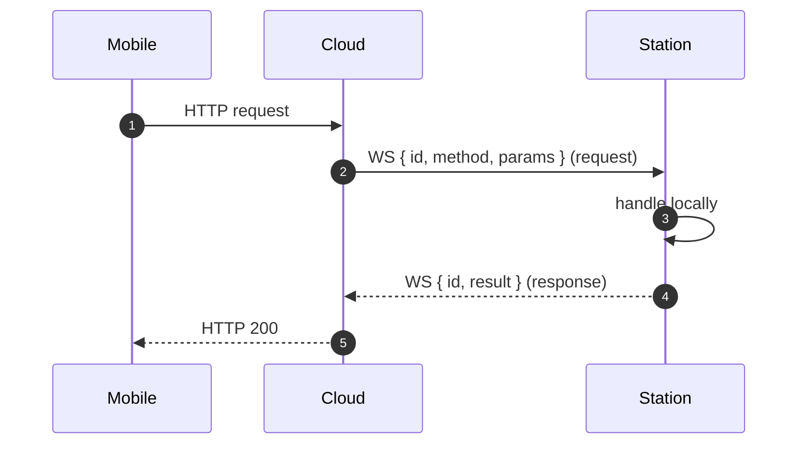

# 🔌 WebSocket Protocol

## Cloud ↔ Station

The Station maintains a persistent WSS connection to Cloud. Two modes:

## JSON-RPC over WS {#jsonrpc}

Cloud and Station communicate via JSON-RPC. Cloud uses `peer.call()` to proxy mobile requests:

Two primitives:

- `peer.call(method, params)` → returns `Promise<result>` (waits for matching `id`)
- `peer.notify(method, params)` → fire-and-forget (no `id`)

## Backend ↔ Frontend (Local) {#frontend-ws}

The Station Backend exposes a local WebSocket for the SPA frontend. Used for:

- Device state push (telemetry → UI in real time)
- Provisioning candidate updates (BLE flow)
- Connection status

Frontend subscribes via `useWsSubscription` hook ([source](https://github.com/alphaoflogic-ua/smart-home/blob/develop/packages/frontend/src/shared/useWsSubscription.ts)).

## Reference

- [Source: cloud WS](https://github.com/alphaoflogic-ua/smart-home-cloud/tree/develop/src/ws)
- [Source: cloud-sync (Station side)](https://github.com/alphaoflogic-ua/smart-home/tree/develop/packages/backend/src/modules/cloud-sync)
- [Source: jsonrpc protocol](https://github.com/alphaoflogic-ua/smart-home-cloud/tree/develop/src/jsonrpc)
