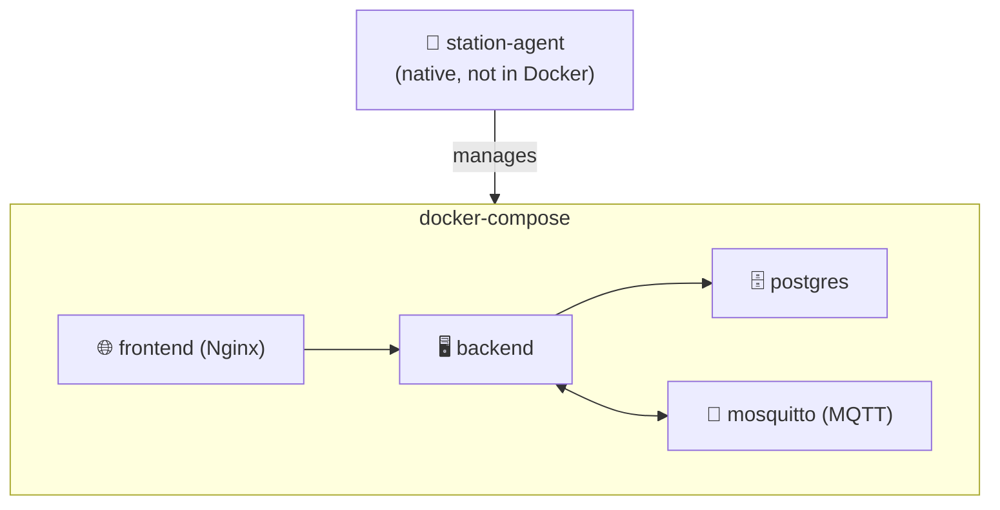

# 🐳 Docker Compose

The Station runs four containers managed by `station-agent`.

## Topology {#topology}

## Container Roles

| Container | Image | Port | Role |
|---|---|---|---|
| `backend` | `<dockerhub>/smart-home-backend` | 3000 | Fastify API + WS + MQTT bridge |
| `frontend` | `<dockerhub>/smart-home-frontend` | 80 | Nginx serving SPA + reverse proxy to backend |
| `postgres` | `postgres:16` | 5432 | Backend DB |
| `mosquitto` | `eclipse-mosquitto:2` | 1883 | MQTT broker |

## Compose File

The production `docker-compose.yml` lives in [`smart-home-updates` ↗](https://github.com/alphaoflogic-ua/smart-home-updates/blob/main/docker-compose.yml). station-agent pulls and applies it.

## Updates

When a new app version is released:

1. station-agent reads `release.json` from `smart-home-updates`
2. If `appVersion` changed, agent runs `docker compose pull`
3. Then `docker compose up -d` — Docker recreates only changed services

[See station-agent flow](/station/station-agent#self-update-flow).
