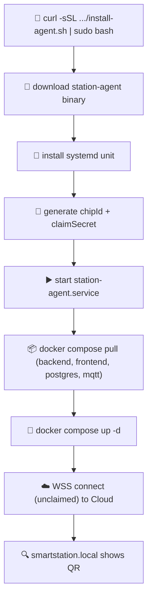

# 📥 Station Installation

Fresh Raspberry Pi → running Station, ready to claim.

## install-agent.sh Flow {#install-flow}

## Source

The install script and compose files live in [`smart-home-updates` ↗](https://github.com/alphaoflogic-ua/smart-home-updates):

| File | Purpose |
|---|---|
| `install-agent.sh` | One-line installer for fresh RPi |
| `docker-compose.yml` | Production compose (backend, frontend, postgres, mqtt) |
| `nginx/` | Nginx config for SPA + reverse proxy |
| `station-agent/station-agent-linux-arm64` | Latest agent binary |
| `release.json` | Manifest with current versions and URLs |

## First Boot

After `install-agent.sh` completes:

1. Connect device to local network (Ethernet or pre-configured Wi-Fi)
2. Open `http://smartstation.local` on a phone in the same network
3. Scan QR code with the Svaroh mobile app to claim
4. Set up Wi-Fi credentials and create owner account

## Reset

To re-claim a station: stop services, remove `cloud_config` row, restart agent.
