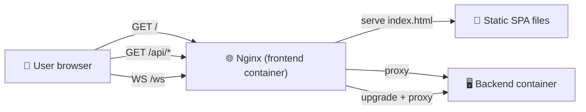

# 🌐 Nginx

The frontend container runs Nginx with two roles: serve the SPA and reverse-proxy `/api` and `/ws` to the backend.

## Request Routing {#routing}



## Config

Lives in [`smart-home-updates/nginx/` ↗](https://github.com/alphaoflogic-ua/smart-home-updates/tree/main/nginx). Key blocks:

```nginx
server {
    listen 80;

    # SPA fallback
    location / {
        root /usr/share/nginx/html;
        try_files $uri $uri/ /index.html;
    }

    # API proxy
    location /api/ {
        proxy_pass http://backend:3000;
        proxy_http_version 1.1;
        proxy_set_header Host $host;
    }

    # WebSocket
    location /ws {
        proxy_pass http://backend:3000;
        proxy_http_version 1.1;
        proxy_set_header Upgrade $http_upgrade;
        proxy_set_header Connection "upgrade";
    }
}
```

## TLS

Local Station does not use HTTPS by default — it's accessed over LAN at `smartstation.local`. Cloud (`docs.svaroh.com`, `api.svaroh.com`) terminates TLS on its own Nginx with Let's Encrypt.

## Reference

- [smart-home-updates/nginx/ ↗](https://github.com/alphaoflogic-ua/smart-home-updates/tree/main/nginx)
