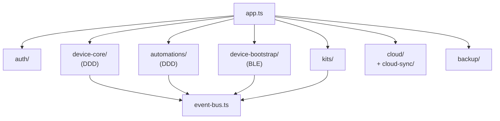
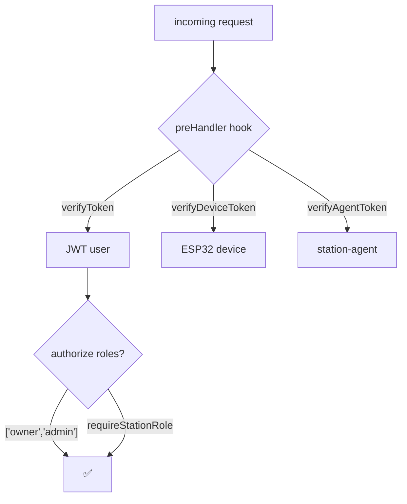

# 🖥️ Station Backend

Fastify + PostgreSQL + MQTT bridge + WebSocket. Owns all device data and automation execution.

[Source ↗](https://github.com/alphaoflogic-ua/smart-home/tree/develop/packages/backend)

## Module Layout {#modules}



## Standard Module Pattern

Most modules follow Routes / Repository / Service:

```
modules/{module}/
  {module}Routes.ts       — Fastify routes (Zod validation)
  {module}Repository.ts   — SQL queries
  {module}Service.ts      — Business logic
```

## DDD Modules: device-core, automations

These two have a richer layout:

```
device-core/
  domain/          — aggregates, events
  application/     — service factory
  infrastructure/  — repository factory
  adapters/        — mqtt, ws, db-writer
  event-bus.ts     — typed EventEmitter
  index.ts         — wiring
```

## Auth Hooks {#auth}



## Event Bus

Cross-module events use a typed EventEmitter ([`event-bus.ts`](https://github.com/alphaoflogic-ua/smart-home/blob/develop/packages/backend/src/modules/device-core/event-bus.ts)):

```typescript
eventBus.emit(DEVICE_EVENTS.DEVICE_DELETED, { deviceId, deviceName });
eventBus.on(DEVICE_EVENTS.DEVICE_STATE_CHANGED, (payload) => { /* typed */ });
```

## Cloud Integration {#cloud}

- `cloud/` — owns `cloud_config` (single-row table with stationToken)
- `cloud-sync/` — handles `identity_sync`, `member_added/removed/updated` notifications from Cloud
- `ws/cloudClient.ts` — WSS client to Cloud (claim_handshake or station_auth)

## Reference

- Conventions: see [Fastify backend rules ↗](https://github.com/alphaoflogic-ua/smart-home/blob/develop/.claude/rules/svaroh/fastify-backend.md)
- Station-specific: [backend.md ↗](https://github.com/alphaoflogic-ua/smart-home/blob/develop/.claude/rules/backend.md)
