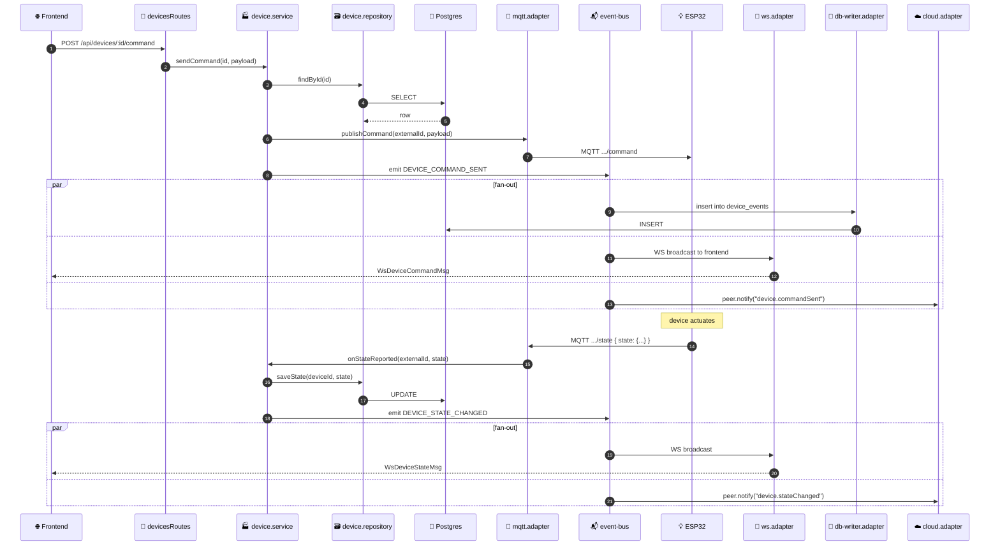
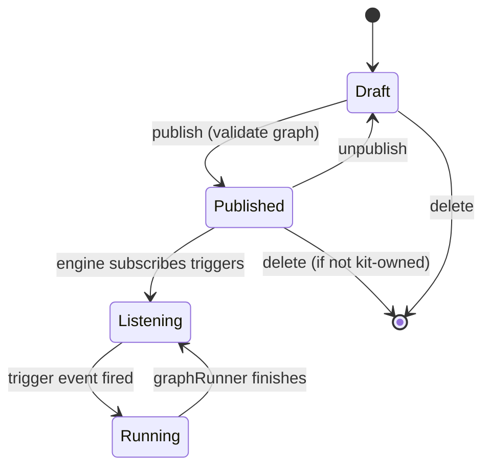
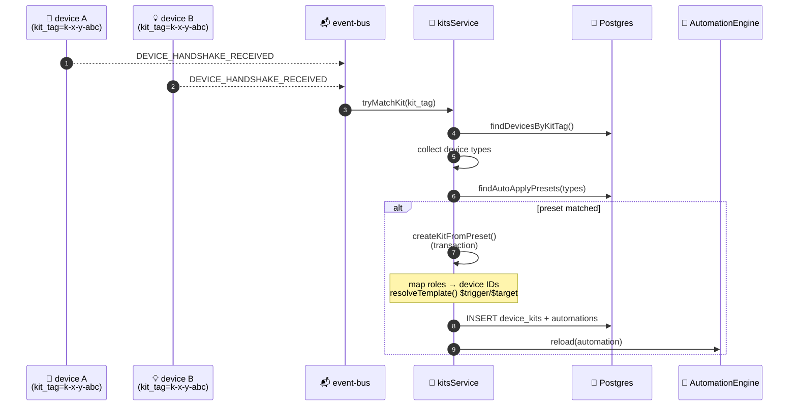

# 🧩 Backend Domain

The core business logic lives in three modules — `device-core`, `automations`, `kits` — plus a typed `event-bus` that decouples them.

## DDD Layout

`device-core/` and `automations/` use a strict layout:

```
{module}/
  domain/          — types, events, aggregates (no I/O, no DB)
  application/     — services (factory functions, business logic)
  infrastructure/  — repositories (SQL queries)
  adapters/        — protocol bridges (mqtt, ws, db-writer, cloud)
  index.ts         — wiring (composition root)
```

**Why factory functions instead of classes?** Per [TypeScript conventions ↗](https://github.com/alphaoflogic-ua/smart-home/blob/develop/.claude/rules/svaroh/typescript.md) — no classes anywhere in the codebase. `createDeviceService({ repository, eventBus, ... })` returns a plain object with methods, dependencies are injected at wiring time.

## Internal Request Lifecycle {#lifecycle}

How a command from the frontend (or mobile via cloud) reaches a device, and how state propagates back:



The right-hand side shows the **decoupling** — service emits one event, three adapters react independently. Adding a new sink (e.g. analytics) is just another `eventBus.on(...)` registration in a new adapter.

## device-core

Owns the `devices` table and the device lifecycle (online/offline, state, handshake).

### Files

```
device-core/
  domain/
    device.aggregate.ts    — createDevice() factory
    device.events.ts       — DEVICE_EVENTS enum
  application/
    device.service.ts      — createDeviceService()
  infrastructure/
    device.repository.ts   — createDeviceRepository()
  adapters/
    mqtt.adapter.ts        — MQTT topics ↔ service
    ws.adapter.ts          — events → WebSocket broadcast
    db-writer.adapter.ts   — events → device_events log
    cloud.adapter.ts       — events → Cloud JSON-RPC
  event-bus.ts             — typed EventBus
  index.ts                 — wiring
```

### Service Methods

`createDeviceService({ repository, eventBus, deviceTypesService, publishCommand })` returns:

| Method | Triggered by | Effect |
|---|---|---|
| `onHandshake(externalId, payload)` | mqtt.adapter on `.../handshake` | Lookup device type, publish `handshake/ack`, emit `DEVICE_HANDSHAKE_RECEIVED` |
| `onStateReported(externalId, state)` | mqtt.adapter on `.../state` | `saveState`, emit `DEVICE_STATE_CHANGED` (+ `DEVICE_STATE_TRANSITION` for boolean caps) |
| `onHeartbeat(externalId, status)` | mqtt.adapter on `.../heartbeat` | Update `last_heartbeat_at`, emit `DEVICE_STATUS_CHANGED` if changed |
| `onEvent(externalId, event)` | mqtt.adapter on `.../event` | Emit `DEVICE_EVENT_RECEIVED` |
| `sendCommand(id, payload)` | devicesRoutes (HTTP) | Validate, `publishCommand`, emit `DEVICE_COMMAND_SENT` |

### Adapters

| Adapter | Listens / subscribes to | Action |
|---|---|---|
| **mqtt.adapter** | MQTT topics: `state`, `event`, `heartbeat`, `handshake` | Calls service methods; publishes `handshake/ack` |
| **ws.adapter** | event-bus: `DEVICE_STATE_CHANGED`, `DEVICE_STATUS_CHANGED`, `DEVICE_EVENT_RECEIVED`, `DEVICE_DELETED`, `DEVICE_STATE_TRANSITION`, `AUTOMATION_RUN_COMPLETED` | Broadcasts to all connected WS frontend clients |
| **db-writer.adapter** | event-bus: `DEVICE_STATUS_CHANGED`, `DEVICE_COMMAND_SENT`, `DEVICE_EVENT_RECEIVED`, `DEVICE_STATE_TRANSITION` | Inserts row into `device_events` (activity feed) |
| **cloud.adapter** | event-bus: `DEVICE_STATE_CHANGED`, `DEVICE_STATUS_CHANGED`, `DEVICE_DELETED` | Sends `peer.notify(...)` to Cloud over WSS for mobile clients |

## automations

Graph-based automation engine — flows are JSON `{ nodes, edges }` stored in `automations.flow_definition`.

### Files

```
automations/
  domain/
    automation.types.ts        — ExecutionContext, ExecutionResult, NodeExecutor
    automation.events.ts       — AUTOMATION_EVENTS enum
  application/
    automationEngine.ts        — runtime registry
    automationService.ts       — CRUD + publish lifecycle
    graphRunner.ts             — runGraph() executes a flow
  infrastructure/
    automationRepository.ts
  adapters/
    nodeRegistry.ts            — getExecutor(kind)
    nodeExecutors/
      delay.ts                 — sleep N seconds
      deviceCommand.ts         — call deviceService.sendCommand()
      webhook.ts               — HTTP GET/POST with timeout
  automationsRoutes.ts
  index.ts
```

### Engine Lifecycle



- `automationEngine.start()` — loads published automations on boot
- `automationEngine.reload(automation)` — re-registers triggers after edit
- `automationEngine.unregister(id)` — removes triggers (used on unpublish/delete)
- `graphRunner.runGraph(flow, ctx)` — walks edges from trigger, calls executors

### Node Executors

| Executor | What it does |
|---|---|
| **delay** | Sleeps for `config.seconds`, returns `{ status: 'success' }` |
| **deviceCommand** | Calls `deviceService.sendCommand(deviceId, command)`, captures errors |
| **webhook** | Performs `fetch(url, { method, body })` with 10s timeout, fails on non-2xx |

To add a new executor: implement `NodeExecutor` interface, register in `nodeRegistry.ts`. UI categories (`trigger`/`condition`/`action`) are described in [shared types ↗](https://github.com/alphaoflogic-ua/smart-home/blob/develop/packages/shared/src/types/automation.ts).

## kits

Auto-creation of automations from device pairs that share a `kit_tag`.

### Auto-Creation Flow



### kitsService — Key Functions

| Function | Purpose |
|---|---|
| `tryMatchKit(kitTag)` | Subscribed to `DEVICE_HANDSHAKE_RECEIVED`; auto-applies matching `auto_apply` preset |
| `applyPreset(kitId, presetId, userId)` | Manual preset application via REST |
| `createKitFromPreset()` | Internal: assigns devices to roles, resolves template variables, atomic insert |
| `resolveTemplate()` | Recursively replaces `$roleKey` strings (e.g. `$trigger`, `$target`) with device IDs |
| `computeDevicesHash()` | SHA256 of sorted device IDs — used in `(preset_id, devices_hash)` UNIQUE constraint to prevent duplicates |
| `deleteKit(id)` | Cascades automations + unregisters from engine |

### Preset Structure

```jsonc
{
  "name": "switch-light",
  "roles": [
    { "key": "trigger", "type": "switch-pir" },
    { "key": "target", "type": "light" }
  ],
  "automation_templates": [
    {
      "name": "Button → Toggle Light",
      "nodes": [
        { "id": "t1", "type": "trigger",
          "data": { "kind": "device_event_received",
                    "config": { "deviceId": "$trigger", "eventAction": "button_press" } } },
        { "id": "a1", "type": "action",
          "data": { "kind": "device_command",
                    "config": { "deviceId": "$target", "command": "toggle" } } }
      ],
      "edges": [{ "id": "e1", "source": "t1", "target": "a1" }]
    }
  ],
  "auto_apply": true
}
```

`$trigger` / `$target` are template variables matching `roles[].key`.

## Event Bus

Typed `EventEmitter` wrapper at [`device-core/event-bus.ts` ↗](https://github.com/alphaoflogic-ua/smart-home/blob/develop/packages/backend/src/modules/device-core/event-bus.ts). Single instance, all modules import it.

### All Events

| Event | Payload | Emitted by |
|---|---|---|
| `DEVICE_STATE_CHANGED` | `{ deviceId, state, timestamp }` | device.service.onStateReported |
| `DEVICE_STATE_TRANSITION` | `{ deviceId, deviceName, deviceType, capabilityKey, oldValue, newValue, timestamp }` | device.service (on boolean cap toggle) |
| `DEVICE_STATUS_CHANGED` | `{ deviceId, deviceName, deviceType, status, timestamp }` | device.service (online ↔ offline) |
| `DEVICE_HANDSHAKE_RECEIVED` | `{ deviceId, kitTag }` | device.service.onHandshake |
| `DEVICE_COMMAND_SENT` | `{ deviceId, deviceName, command, timestamp }` | device.service.sendCommand |
| `DEVICE_EVENT_RECEIVED` | `{ deviceId, deviceName, deviceType, event, data, timestamp }` | device.service.onEvent |
| `DEVICE_DELETED` | `{ deviceId, deviceName }` | devicesService on hard delete |
| `AUTOMATION_RUN_COMPLETED` | `{ automationId, automationName, status, timestamp }` | graphRunner |

### Usage

```typescript
import { eventBus } from '../device-core/event-bus.js';
import { DEVICE_EVENTS } from '../device-core/domain/device.events.js';

// emit (from service)
eventBus.emit(DEVICE_EVENTS.DEVICE_DELETED, { deviceId, deviceName });

// subscribe (from adapter)
eventBus.on(DEVICE_EVENTS.DEVICE_STATE_CHANGED, (payload) => {
  // payload is fully typed
});
```

## Reference

- [Backend rules (DDD modules) ↗](https://github.com/alphaoflogic-ua/smart-home/blob/develop/.claude/rules/backend.md)
- [kits-automations.md (original) ↗](https://github.com/alphaoflogic-ua/smart-home/blob/develop/docs/kits-automations.md)
- [shared automation types ↗](https://github.com/alphaoflogic-ua/smart-home/blob/develop/packages/shared/src/types/automation.ts)
