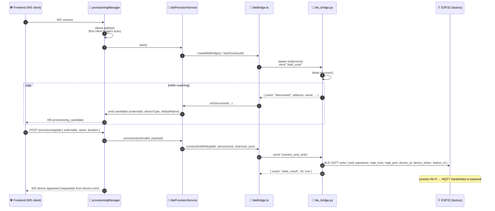
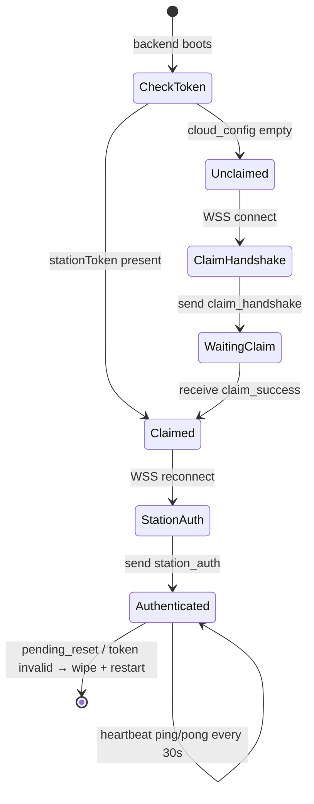

# 🔌 Backend Integrations

External boundaries: BLE provisioning (Python bleak), MQTT broker, Cloud WSS (JSON-RPC), and auth.

## BLE Device Provisioning {#ble}

The `device-bootstrap/` module — Node side of BLE provisioning. Talks to `scripts/ble_bridge.py` (Python `bleak`) via stdin/stdout JSON, broadcasts candidates over WS to connected frontend clients, performs the BLE write to provision a found ESP32 with Wi-Fi creds + station info.

### Files

```
modules/device-bootstrap/
  bleBridge.ts             — spawns Python subprocess; createBleBridge(logger)
  bleProvisionService.ts   — orchestrates scan + provision; emits candidates
  provisioningManager.ts   — WS client registry; broadcast candidates; provision()
  bleProvisionRoutes.ts    — REST endpoint POST /provisioning/add
  deviceBootstrapRoutes.ts — REST endpoints for the agent (Wi-Fi config, etc.)
  deviceBootstrapService.ts — agent-related logic
  deviceBootstrapSchemas.ts
```

### Lifecycle



### Python Bridge Protocol

`bleBridge.ts` ↔ `ble_bridge.py` exchange newline-delimited JSON over stdio:

| Direction | Event | Fields |
|---|---|---|
| TS → PY | `start_scan` | `service_uuid` |
| TS → PY | `stop_scan` | — |
| TS → PY | `connect_and_write` | `address`, `service_uuid`, `characteristic_uuid`, `payload` |
| PY → TS | `ready` | — |
| PY → TS | `discovered` | `address`, `name`, `rssi`, `service_uuids[]`, `service_data{}` |
| PY → TS | `scan_started` / `scan_stopped` | — |
| PY → TS | `write_result` | `address`, `ok`, optional `error` |

[`scripts/ble_bridge.py` ↗](https://github.com/alphaoflogic-ua/smart-home/blob/develop/packages/backend/scripts/ble_bridge.py) — pure transport, no business logic.

:::note Why Python
Node BLE bindings on Linux (Bluez) are unreliable. `bleak` is the most stable cross-platform BLE library. Subprocess + JSON-over-stdio gives clean isolation — the rest of the backend stays Node.
:::

### Scan Lifecycle

- **First WS client connects** → `provisioningManager.addClient()` → starts scan
- **Last WS client disconnects** → stops scan, clears candidate cache
- **Candidates accumulate** while scan runs; new clients receive replay of current candidates

## MQTT Bridge {#mqtt}

Backend connects to the local Mosquitto broker (same Docker stack). The bridge is in `mqtt/mqttClient.ts` plus the `device-core/adapters/mqtt.adapter.ts` that wires topic handlers to the device service.

### Topic Subscriptions

The MQTT adapter (registered during `device-core/index.ts` wiring) subscribes to:

| Topic pattern | Handler |
|---|---|
| `station/+/device/+/handshake` | `deviceService.onHandshake()` → publish `handshake/ack` |
| `station/+/device/+/state` | `deviceService.onStateReported()` |
| `station/+/device/+/event` | `deviceService.onEvent()` |
| `station/+/device/+/heartbeat` | `deviceService.onHeartbeat()` |

See [📡 MQTT Protocol](/protocols/mqtt) for the full topic and payload reference.

### Outbound Commands

`publishCommand(externalId, payload)` from `mqtt/mqttClient.ts` — used by:

- `device.service.sendCommand()` — user-initiated commands via REST
- `automation` `deviceCommand` node executor — automation-driven commands
- `cloud-sync.station_reset` handler — `factory_reset` command on all devices

## Cloud Integration {#cloud}

Two modules cooperate:

- **`cloud/`** — owns `cloud_config` table (single-row: `station_token`, `claimed_at`); exposes `/api/cloud/status`; manages active event channels
- **`cloud-sync/`** — handles inbound legacy messages from Cloud (identity sync, member events, station reset)

The transport is in **`ws/cloudClient.ts`** — a JSON-RPC peer wrapping a WebSocket to `wss://<CLOUD_HOST>/ws/station`.

### Connection Modes



### JSON-RPC Methods Registered (Cloud → Station)

After `auth_ok`, the station registers a handful of handlers callable by Cloud via `peer.call()` — covering device commands, device/type snapshots and event-channel configuration. Exact method names and payload shapes live in the source.

### Outbound (Station → Cloud)

The cloud adapter in `device-core/adapters/cloud.adapter.ts` calls `peer.notify(...)` for state changes (see [Domain → device-core adapters](/station/backend/domain#device-core)).

### Heartbeat

Backend pings the WSS every 30s; if no `pong` within the next interval — `terminate()` and reconnect with exponential backoff (2s → 60s, 20% jitter).

### cloud-sync Message Handlers

The Cloud sends "legacy" plain-JSON messages (not JSON-RPC) for identity and lifecycle changes — `peer.onLegacyMessage` forwards them to `processCloudMessage`. They cover member sync (add / update / remove), station rename, password sync and factory reset. Handler details live in the source.

## Auth Hooks Deep Dive {#auth}

[`hooks/authHooks.ts` ↗](https://github.com/alphaoflogic-ua/smart-home/blob/develop/packages/backend/src/hooks/authHooks.ts) and [`hooks/deviceAuthHooks.ts` ↗](https://github.com/alphaoflogic-ua/smart-home/blob/develop/packages/backend/src/hooks/deviceAuthHooks.ts).

### `verifyToken` — JWT user

```typescript
fastify.addHook('preHandler', verifyToken);
// or per-route:
fastify.post('/path', { preHandler: verifyToken }, ...);
```

- Reads `Authorization: Bearer <jwt>`
- `jwt.verify(token, env.JWT_SECRET)` — must contain `userId` and `role`
- On success sets `request.user = { userId, role }`
- On failure: `401 Unauthorized`
- Skipped for `OPTIONS` and `HEAD`

### `authorize(roles)` — global role

```typescript
{ preHandler: [verifyToken, authorize(['owner', 'admin'])] }
```

Pure check against `request.user.role`. **Global**, not per-station. `403` on mismatch.

### `requireStationRole(...)` — station-membership-scoped

```typescript
{ preHandler: [verifyToken, requireStationRole('owner')] }
```

Stronger check — fetches the station's owner from `station` table; if user is owner → role = `owner`; otherwise looks up `station_members` for the user's role. `403` if user is not in `station_members` and not the owner.

This is the right hook for station-scoped operations (e.g. inviting members).

### `verifyDeviceToken` — ESP32 → backend

```typescript
{ preHandler: verifyDeviceToken }
```

- Reads `X-Device-Token` (or fallback `Device-Token`) header
- `SELECT id FROM devices WHERE device_token = $1`
- On success sets `request.deviceId`
- Used by routes the firmware calls (e.g. event reporting outside MQTT)

### `verifyAgentToken` — station-agent → backend

```typescript
{ preHandler: verifyAgentToken }
```

- Reads `Authorization: Bearer <token>`, compares plain-equality with `env.AGENT_TOKEN`
- Used by station-agent endpoints (network config, restart, etc.)

### When to use which {#when-to-use}

| Caller | Hook |
|---|---|
| Mobile app via Cloud (relayed) | n/a — cloud handles auth, station receives via JSON-RPC |
| Web SPA on LAN | `verifyToken` (+ `authorize` or `requireStationRole`) |
| ESP32 device | `verifyDeviceToken` |
| station-agent (RPi) | `verifyAgentToken` |

## Reference

- [JsonRpcPeer ↗](https://github.com/alphaoflogic-ua/smart-home/blob/develop/packages/backend/src/jsonrpc/JsonRpcPeer.ts)
- [bleBridge.ts ↗](https://github.com/alphaoflogic-ua/smart-home/blob/develop/packages/backend/src/modules/device-bootstrap/bleBridge.ts)
- [cloudSyncService.ts ↗](https://github.com/alphaoflogic-ua/smart-home/blob/develop/packages/backend/src/modules/cloud-sync/cloudSyncService.ts)
- [Cloud-side WS handshake ↗](https://github.com/alphaoflogic-ua/smart-home-cloud/tree/develop/src/ws)
