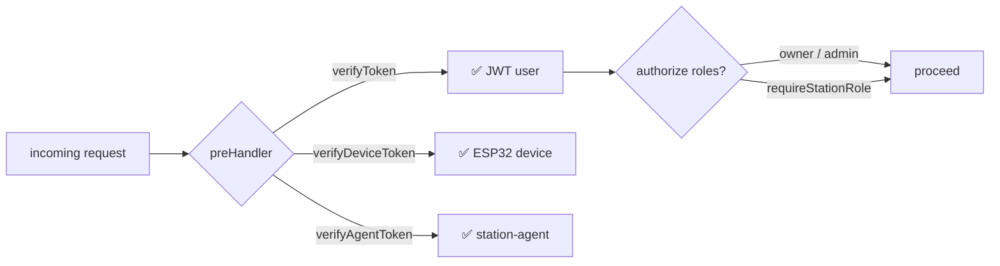
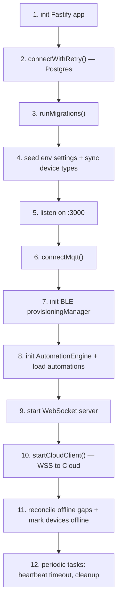

# 🖥️ Backend Overview

Fastify monolith with **18 modules** under `src/modules/`, each self-contained. Most follow Routes / Repository / Service. Two use DDD (`device-core/`, `automations/`), one bridges to Python (`device-bootstrap/`).

## Tech Stack

- **Runtime**: Node.js (ESM)
- **Framework**: Fastify + Zod + `@fastify/swagger` + Scalar UI
- **DB**: PostgreSQL 16 via `pg` (no ORM, raw SQL with `query<T>()`)
- **MQTT**: `mqtt` library, broker is Mosquitto in same Docker stack
- **WebSocket**: `@fastify/websocket` for local frontend, separate WSS client to Cloud
- **BLE**: Python `bleak` via subprocess (`scripts/ble_bridge.py`)

## Module Map {#modules}

| Module | Layout | DB Tables | Endpoints |
|---|---|---|---|
| `auth` | Standard | `users`, `refresh_tokens` | `/api/auth/*` |
| `users` | Standard | `users` (cloud-synced read) | `/api/users/*` |
| `user-management` | Standard | `users`, `station_members` | `/api/user-management/*` |
| `devices` | Standard | `devices` | `/api/devices/*` |
| `device-types` | Standard | `device_types` (registry sync) | `/api/device-types` |
| `device-events` | Standard | `device_events`, `event_settings`, `device_type_event_presets` | `/api/device-events/*` |
| `device-bootstrap` | Service + Python bridge | — (provisioning candidates in memory) | `/api/device/*` |
| `device-core` | DDD | `devices`, `device_types` | — (event-driven, no REST) |
| `zones` | Standard | `zones` | `/api/zones/*` |
| `automations` | DDD | `automations`, `automation_runs` | `/api/automations/*` |
| `kits` | Standard | `device_kits`, `kit_presets` | `/api/kits/*` |
| `firmware` | Standard | `firmwares` | `/api/firmware/*` |
| `ota` | Standard | `ota_logs` | `/api/ota/*` |
| `wifi` | Standard | — (system calls) | `/api/wifi/*` |
| `settings` | Standard | `station_settings` | `/api/settings/*` |
| `backup` | Service-only | (reads/writes all) | `/api/backup/*` |
| `cloud` | Config + WS client | `cloud_config` | `/api/cloud/status` |
| `cloud-sync` | Sync service | `users` (write) | — (WSS-driven) |
| `station` | Repository-only | `station`, `station_members` | — |

## DB Schema {#db}

Migrations in [`src/db/migrations/` ↗](https://github.com/alphaoflogic-ua/smart-home/tree/develop/packages/backend/src/db/migrations) — sequential `001_`, `002_`, ... applied on boot via `runMigrations()`.


## Conventions

### Routes

```typescript
export const myRoutes = (fastify: FastifyInstance) => {
  fastify.addHook('preHandler', verifyToken);

  fastify.post(
    '/',
    { preHandler: authorize(['owner', 'admin']) },
    async (request, reply) => {
      const body = CreateSchema.parse(request.body);
      const result = await myService.create(body);
      return reply.status(201).send(result);
    },
  );
};
```

- Routes registered in `app.ts` with prefix: `app.register(myRoutes, { prefix: '/api/my' })`
- All Zod schemas use **camelCase keys**
- Errors via `reply.status(code).send({ message })` — global `setErrorHandler` shapes the response

### Repositories

```typescript
import { query } from '../../db/db.js';
import type { Device } from '@smart-home/shared';

export const findById = async (id: string): Promise<Device | null> => {
  const result = await query<Device>('SELECT * FROM devices WHERE id = $1', [id]);
  return result.rows[0] ?? null;
};
```

- `query<T>()` **auto-converts snake_case → camelCase** in result rows
- Parameterized SQL only (`$1, $2, ...`)
- Returns `null` for not found, no exceptions for normal absence

### Services

- Import repository as `import * as myRepo from './myRepository.js'`
- No direct `query()` — all SQL through the repository
- Use `logger` (never `console`, never `fastify.log`)

### Auth Hooks {#auth}



| Hook | Verifies | Source |
|---|---|---|
| `verifyToken` | JWT Bearer (user session) | `hooks/authHooks.ts` |
| `authorize(roles)` | Global role: `owner`/`admin`/`member` | `hooks/authHooks.ts` |
| `requireStationRole(...)` | Station-membership-scoped role | `hooks/authHooks.ts` |
| `verifyDeviceToken` | Device-to-backend auth (per-device token) | `hooks/deviceAuthHooks.ts` |
| `verifyAgentToken` | station-agent talking to backend | `hooks/deviceAuthHooks.ts` |

## Boot Sequence



Source: [`src/server.ts` ↗](https://github.com/alphaoflogic-ua/smart-home/blob/develop/packages/backend/src/server.ts)

## Periodic Maintenance

| Job | Interval | Purpose |
|---|---|---|
| Heartbeat timeout | every minute | Mark device offline if no heartbeat for 3 min |
| Refresh token cleanup | 24h | Delete expired `refresh_tokens` rows |
| Automation runs cleanup | 24h | Delete `automation_runs` older than 30 days |
| Device events cleanup | 24h | Delete `device_events` older than 30 days |

## Reference

- [Fastify backend conventions ↗](https://github.com/alphaoflogic-ua/smart-home/blob/develop/.claude/rules/svaroh/fastify-backend.md)
- [Backend-specific rules ↗](https://github.com/alphaoflogic-ua/smart-home/blob/develop/.claude/rules/backend.md)
- [TypeScript conventions ↗](https://github.com/alphaoflogic-ua/smart-home/blob/develop/.claude/rules/svaroh/typescript.md)
