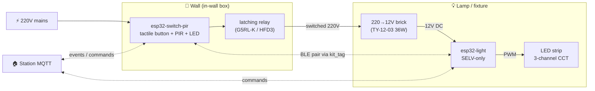

# 🔌 Hardware

The first commercial product is a **switch+light kit** — two ESP32 devices that replace a regular wall switch and ceiling light, paired automatically via `kit_tag` over BLE.

## Positioning

- **Market**: premium / smart-home enthusiasts (priced between Shelly/Sonoff and Lutron Caseta).
- **Install path**: electrician-installed, not DIY. End-user just sees a normal switch that also has app/voice control.
- **Closest competitors**: Aqara H1, Philips Hue (with comparable positioning, but local-first and open-source).

## Kit Composition



### esp32-switch-pir

- Mounts in a standard in-wall box, replaces a regular wall switch
- **Latching 220V relay** (Omron G5RL-K or Hongfa HFD3) — physically switches mains to the lamp fixture
- **Tactile button** (momentary, not toggle) — lit by an LED indicator on the front face
- **PIR sensor** (HC-SR501) — motion detection
- **Hardware T-flip-flop** between button and relay driver (74HC74 + 74HC123 edge detector) — keeps button → light working even if the ESP32 dies
- Powered by **HLK-PM03** isolated AC/DC module (220V → 5V)

### esp32-light

- Mounts inside the lamp fixture
- **SELV-only board** (no 220V inside) — fed by external 12V brick
- **MP1584EN buck** (12V → 5V) + LDO for ESP32 (3.3V)
- **3× MOSFET** (IRLZ44N) for 3-channel CCT LED strip (Warm/Neutral/Cool white)
- **No RGB** in this revision (would need different LED strip)

## Architectural Principle: Local-First

> **The physical toggle of the switch must not depend on the network or the microcontroller.**

The path button → light is purely hardware:

```
button → RC debounce → 74HC74 T-flip-flop → 74HC123 edge detector
       → dual MOSFET driver → latching relay coil → 220V to lamp
```

ESP32 sits **in parallel** to this path:
- Reads the button GPIO for long-press detection and MQTT events
- Reads the flip-flop's `Q` output to know current state
- Can **override** state via `PRE`/`CLR` lines (for MQTT commands and PIR automations)

### Failure Modes

| Fault | Effect on basic on/off |
|---|---|
| Wi-Fi router down | ✅ Switch works locally |
| Station (RPi + MQTT) down | ✅ Switch works locally |
| ESP32 in light dies | ✅ Relay still feeds 220V → lamp on at default brightness |
| ESP32 in switch dies | ✅ Button works (flip-flop is hardware); only MQTT features lost |
| HLK-PM03 (AC/DC) dies | ❌ Light freezes in last state — single weak link |
| Mains breaker off | ❌ Everything off (expected) |

This is roughly as reliable as a dumb mechanical switch — modulo one AC/DC module.

## Topology Decision: Variant A (switch physically toggles 220V)

When the wall switch is "off", the lamp fixture is fully de-energized — same UX as a regular dumb switch.

Rejected alternatives:
- **B (always-on, MQTT-only toggle)** — violates local-first (network latency on toggle, station outage breaks lights).
- **C (NC relay default ON)** — inverted logic; ESP reset desyncs from physical state.

## What MQTT Adds (post local-first)

Network is **not needed** for basic on/off. What MQTT enables:

| Direction | Purpose |
|---|---|
| switch → station | `button_long_press`, `motion_detected`, `state_changed` events for automations |
| light → station | `state_changed` after boot, brightness telemetry |
| station → light | `set_brightness` (0–100%), `set_cct` (2700K–6500K mix across WW/NW/CW channels) |

Single short presses stay fully local — never sent as commands.

## The `switch-light` Preset

The kit auto-creates automations from a preset. Useful presets that use MQTT:

1. **PIR → light with timeout** — motion detected → if light is on, set brightness 100% and reset timer; no motion for N min → set brightness 0%
2. **Long press → night mode** — `button_long_press` → `set_brightness(30%)` or cycle through brightness presets

Single press stays untouched (relay handles it directly).

See [station/backend/domain → kits](/station/backend/domain#kits) for how presets become automations.

## Open Questions

- **PIR behaviour when light is off** — three options: (a) PIR passive, only publishes events; (b) PIR auto-closes the relay (motion → light); (c) preset config switch. Leaning towards (c) with default off.
- **Production form** — hand-soldered prototype (THT) vs JLCPCB SMT.
- **Certification** — for resale, EN 60669 (switches) and EN 60950 (PSU) apply. Not blocking for prototype.

## Reference

- Full hardware design notes: [`docs/hardware/README.md` ↗](https://github.com/alphaoflogic-ua/smart-home/blob/develop/docs/hardware/README.md)
- KiCad schematics: `firmware/esp32-switch-pir/hardware/`, `firmware/esp32-light/hardware/`
- LED strip: Biom ST-12-2835-120-DCCT-20 3CCT (1500 lm/m, 17 W/m, 4-wire +12V/WW/NW/CW)
