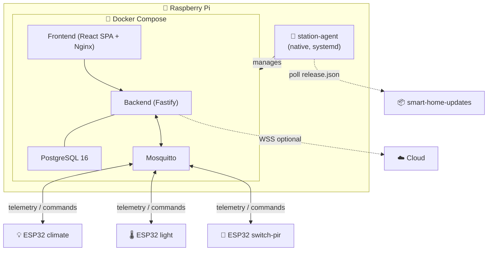

# 🏠 Station Overview

A "station" is everything that runs on a single Raspberry Pi: backend (Fastify), frontend (React SPA), Postgres, MQTT broker, plus the native `station-agent` that manages them. Source lives in the [`smart-home/` ↗](https://github.com/alphaoflogic-ua/smart-home) monorepo.

## What a Station Owns

- All ESP32 device data (devices, telemetry, events)
- Local user accounts (synced from Cloud or LAN-only)
- Automations and kits
- Firmware artefacts and OTA distribution
- Wi-Fi network configuration (via station-agent + captive portal)

It works **fully offline** — Cloud connection is optional and only needed for remote/mobile access.

## Topology



## Monorepo Layout

```
smart-home/
├── packages/
│   ├── backend/        — Fastify API + WS + MQTT bridge
│   ├── frontend/       — React 18 + Vite SPA
│   └── shared/         — Cross-package TypeScript types + Zod schemas
├── firmware/
│   ├── lib/smart-home-core/   — shared C++ library (Wi-Fi, MQTT, BLE, OTA)
│   ├── esp32-climate/         — temperature + humidity + pressure sensor
│   ├── esp32-pir/             — motion detector
│   ├── esp32-light/           — LED actuator (dimmable)
│   └── esp32-switch-pir/      — wall switch with PIR
├── station-agent/      — Native Node binary on RPi (SEA, self-managed via systemd)
├── deployment/         — Docker Compose, install scripts, nginx config
└── docs/               — Internal design notes (mqtt-protocol, kits, hardware, etc.)
```

## Run Commands

From the monorepo root:

```bash
npm run dev              # Turbo: backend + frontend in watch mode
npm run build            # Turbo: build all packages
npm run lint             # eslint across all packages
npm run check-types      # tsc --noEmit
npm run format           # prettier --write
npm run firmware:build   # build ESP32 firmware (scripts/build-firmware.js)
```

## Release

All releases via [`scripts/release.sh` ↗](https://github.com/alphaoflogic-ua/smart-home/blob/develop/scripts/release.sh) — never edit `package.json` versions or create tags manually.

| Tag | What gets built | Where it lands |
|---|---|---|
| `v0.2.77` | backend + frontend Docker images | Docker Hub + `release.json` updated |
| `backend-v0.2.77` | backend only | Docker Hub + `release.json` (frontend untouched) |
| `frontend-v0.2.77` | frontend only | Docker Hub + `release.json` (backend untouched) |
| `firmware-v0.1.5` | all firmware variants | Public registry + `firmware/manifest.json` |
| `firmware-esp32-climate-v0.1.5` | one firmware variant | Public registry + manifest |
| `agent-v1.0.1` | station-agent SEA binary | smart-home-updates repo |

See [Release Flow](/processes/release).

## Conventions

- **Default branch**: `develop`
- **Jira prefix**: `SHS-` (e.g. `SHS-42 add device pairing`)
- **TS conventions**: arrow functions, no classes, enum + Record dispatch — see [TypeScript rules ↗](https://github.com/alphaoflogic-ua/smart-home/blob/develop/.claude/rules/svaroh/typescript.md)

## Reference

- [Project README ↗](https://github.com/alphaoflogic-ua/smart-home/blob/develop/README.md)
- [CLAUDE.md (project manifest) ↗](https://github.com/alphaoflogic-ua/smart-home/blob/develop/CLAUDE.md)
