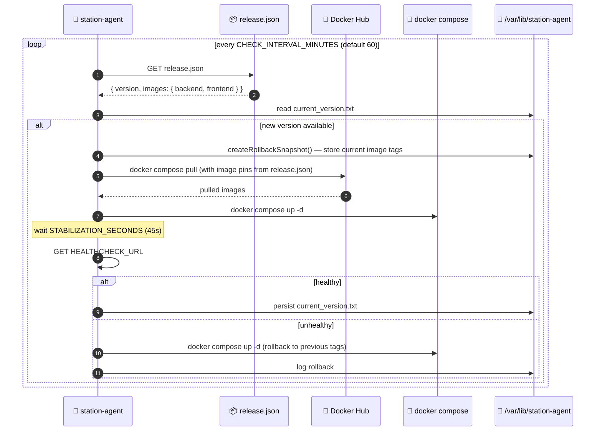
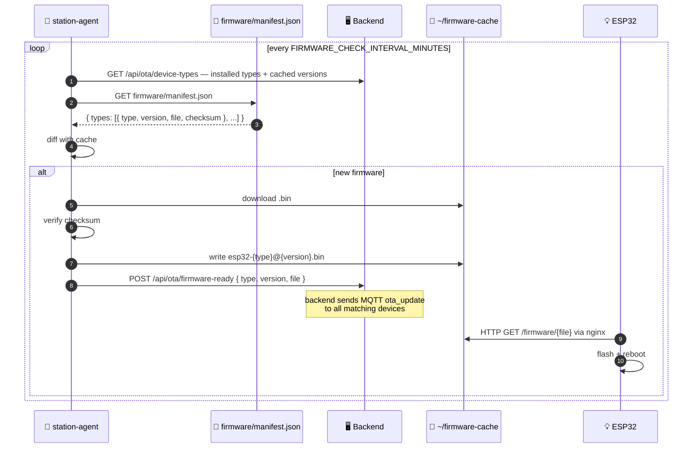
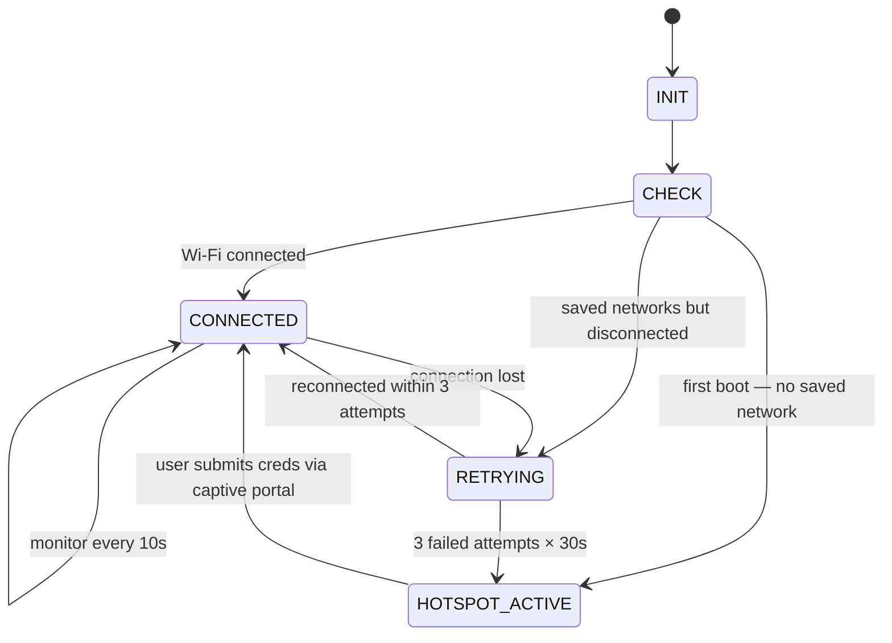

# 🤖 station-agent

Native Node.js binary running on the Raspberry Pi as a `systemd` service. Manages the Docker stack, ESP32 firmware OTA, and Wi-Fi networking (including a captive portal for first-boot setup).

[Source ↗](https://github.com/alphaoflogic-ua/smart-home/tree/develop/station-agent) — built as a SEA (Single Executable Application), no Node.js needed on the host.

## Responsibilities

- 🐳 **Docker updates** — poll `release.json`, pull new images, healthcheck, auto-rollback on failure
- 📡 **Firmware OTA** — poll `firmware/manifest.json`, download `.bin` files, hand them off to the backend → MQTT → ESP32
- 📶 **Wi-Fi watchdog** — state machine for monitoring, retry, fallback to hotspot
- 🌐 **Captive portal** — first-boot or Wi-Fi loss → spin up an AP with web setup form

:::note Agent binary itself is not auto-updated
The binary is installed by `install-agent.sh` and managed by `systemd`. Updating it requires a new `agent-v*` tag → CI rebuilds → reinstall via the install script.
:::

## Installation

One command on a fresh Raspberry Pi:

```bash
curl -fsSL https://raw.githubusercontent.com/alphaoflogic-ua/smart-home-updates/main/install-agent.sh | sudo bash
```

The script:

1. Installs Docker if missing
2. Downloads deployment files (`docker-compose.yml`, `nginx/`, `.env`)
3. Configures the stack interactively (Wi-Fi, secrets, environment)
4. Downloads the agent binary
5. Installs and starts the `station-agent.service` systemd unit

## Reset & Reinstall

```bash
curl -fsSL https://raw.githubusercontent.com/alphaoflogic-ua/smart-home-updates/main/reset-station.sh | sudo bash
```

Removes the systemd service, agent files, the entire Docker stack (with volumes), and the Docker images. Use with care — wipes all device data.

## Docker Update Flow



### `release.json` Format

```json
{
  "version": "1.2.3",
  "images": {
    "backend": "andriicode/smart-home-backend:1.2.3",
    "frontend": "andriicode/smart-home-frontend:1.2.3"
  }
}
```

CI updates this file in `smart-home-updates` repo on every release tag.

## Firmware OTA Flow



## Wi-Fi Watchdog

State machine that keeps the Pi connected, falling back to a hotspot for re-configuration:



## Captive Portal

When entering `HOTSPOT_ACTIVE`:

1. NetworkManager spins up a Wi-Fi access point
2. Nginx is stopped to free port 80
3. Agent serves a setup page at port 80 with a Wi-Fi network picker
4. Captive portal detection (iOS/Android/Windows/macOS) auto-opens the page
5. User submits SSID + password — agent connects, tears down hotspot, restarts nginx
6. Wi-Fi credentials are forwarded to backend (`/api/settings/agent`) for ESP32 provisioning use

## HTTP API

Default port: `3001`. Mutating endpoints require `Authorization: Bearer <AGENT_TOKEN>` if `AGENT_TOKEN` is configured.

```bash
# Health
curl http://localhost:3001/health

# Full status (incl. firmware cache)
curl http://localhost:3001/status

# Current/last installed app version
curl http://localhost:3001/version

# Wi-Fi status (mode, SSID, IP, hotspot, watchdog state)
curl http://localhost:3001/wifi/status

# Force update to latest
curl -X POST http://localhost:3001/update \
  -H 'Authorization: Bearer <token>'

# Force update to specific version
curl -X POST http://localhost:3001/update \
  -H 'Authorization: Bearer <token>' \
  -H 'Content-Type: application/json' \
  -d '{"version": "1.2.3"}'

# Manual rollback
curl -X POST http://localhost:3001/rollback \
  -H 'Authorization: Bearer <token>'
```

## Environment Variables

### Required

| Variable | Description |
|---|---|
| `STATION_ID` | Station UUID |
| `UPDATE_SERVER_URL` | URL to `release.json` |

### Docker Updates

| Variable | Default | Description |
|---|---|---|
| `COMPOSE_PROJECT_PATH` | `~/smart-home` | Path to compose project |
| `COMPOSE_FILE` | `docker-compose.yml` | Compose file name |
| `CHECK_INTERVAL_MINUTES` | `60` | Update poll interval |
| `AUTO_UPDATE` | `true` | Auto-pull on new version |
| `BOOTSTRAP_ON_START` | `false` | Start stack on agent boot if down |
| `HEALTHCHECK_URL` | `http://localhost/api/health` | Post-update healthcheck |
| `STABILIZATION_SECONDS` | `45` | Wait before healthcheck |
| `DOCKER_USERNAME` / `DOCKER_TOKEN` | — | Docker Hub creds (private images) |
| `DOCKER_REGISTRY` | — | Custom registry |
| `BACKEND_CONTAINER_NAME` | `smart-home-backend` | — |
| `FRONTEND_CONTAINER_NAME` | `smart-home-frontend` | — |

### Firmware OTA

| Variable | Default | Description |
|---|---|---|
| `FIRMWARE_MANIFEST_URL` | `{UPDATE_SERVER_URL}/../firmware/manifest.json` | Manifest URL |
| `FIRMWARE_CACHE_DIR` | `~/firmware-cache` | Where `.bin` files land |
| `FIRMWARE_FOLDER` | `/firmware` | URL path served by nginx |
| `FIRMWARE_CHECK_INTERVAL_MINUTES` | `60` | Manifest poll interval |
| `BACKEND_URL` | derived from `HEALTHCHECK_URL` | API target |
| `BACKEND_AGENT_TOKEN` | — | Bearer for `/api/ota/*` |

### Misc

| Variable | Default | Description |
|---|---|---|
| `PORT` | `3001` | Agent HTTP port |
| `HOST` | `127.0.0.1` | Bind address |
| `AGENT_TOKEN` | — | Bearer for protected POST endpoints |
| `DATA_DIR` | `~/station-agent-data` | Agent state directory |

## Filesystem Layout

```
/opt/station-agent/
  station-agent           ← SEA binary
  .env                    ← agent config

/var/lib/station-agent/
  current_version.txt
  rollback.json
  compose.rollback.override.yml
  compose.update.override.yml

~/firmware-cache/
  esp32-climate@0.1.3.bin
  esp32-climate.json      ← cached metadata { version, file, checksum }
  esp32-pir@0.1.3.bin
  ...

~/smart-home/
  docker-compose.yml
  .env                    ← stack config
  nginx/
```

## Logs

```bash
sudo journalctl -u station-agent -f
```

Structured JSON logs:

```json
{"time":"...","event":"update_start","currentVersion":"1.0.0","images":"..."}
{"time":"...","event":"healthcheck_passed","status":200}
{"time":"...","event":"update_completed","currentVersion":"1.2.3"}
```

**Docker events**: `update_start`, `update_completed`, `update_available`, `docker_pull`, `docker_restart`, `healthcheck_passed`, `healthcheck_failed`, `rollback_started`, `rollback_completed`, `bootstrap_start`, `bootstrap_done`.

**Firmware events**: `firmware_download_start`, `firmware_download_done`, `firmware_update_available`, `firmware_ready`, `firmware_old_removed`, `firmware_check_retry`, `firmware_check_failed`.

## Reference

- [Original README ↗](https://github.com/alphaoflogic-ua/smart-home/blob/develop/station-agent/README.md)
- [install-agent.sh ↗](https://github.com/alphaoflogic-ua/smart-home-updates/blob/main/install-agent.sh)
- [reset-station.sh ↗](https://github.com/alphaoflogic-ua/smart-home-updates/blob/main/reset-station.sh)
