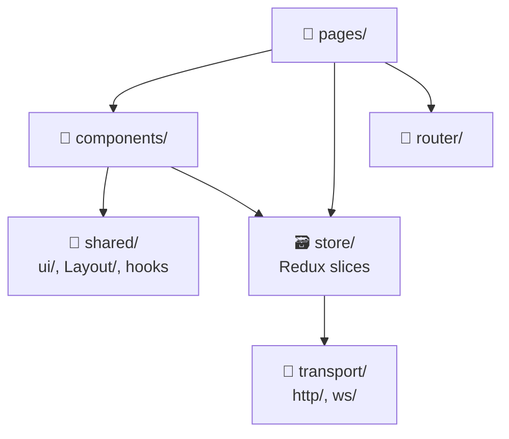
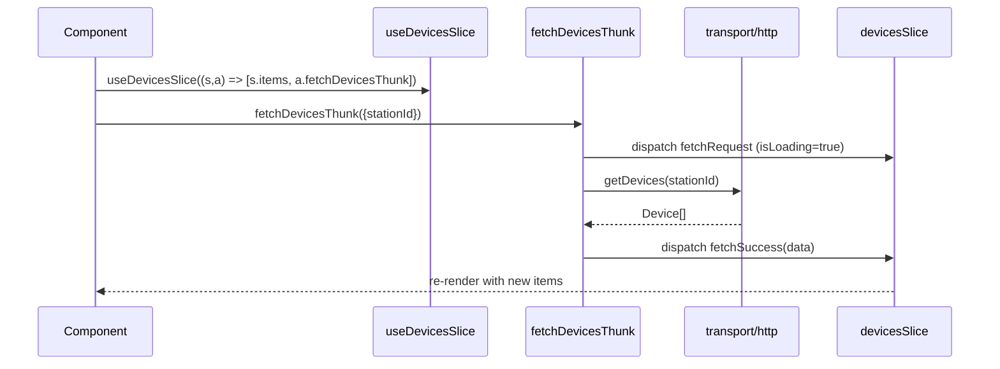

# 🌐 Station Frontend

React 18 + Vite SPA. Connects to Backend via HTTP + WebSocket. Served by Nginx in production.

[Source ↗](https://github.com/alphaoflogic-ua/smart-home/tree/develop/packages/frontend)

## Architecture (Modified FSD) {#fsd}

## Redux Store Pattern {#redux}

Custom convention used across station + mobile: **slices contain only sync reducers**, and thunks dispatch lifecycle actions explicitly (instead of the standard `createAsyncThunk` + `extraReducers` approach).

**Why:** explicit dispatch keeps loading/error state under direct control of the thunk body — easier to reason about optimistic updates, retries, and conditional success dispatches without scattering logic across `extraReducers` cases.

Key helpers from [`store/helpers.ts` ↗](https://github.com/alphaoflogic-ua/smart-home/blob/develop/packages/frontend/src/store/helpers.ts):

- `createAppAsyncThunk` — typed thunk factory
- `withLoading(actions, fn)` — auto-dispatches `fetchRequest` / `fetchFailure`
- `withToast(fn, opts)` — shows toast on success/error, re-throws
- `createSliceHook(name, actions)` — typed `(state, actions)` selector hook
- `makeActionCreator<S>()` — `actReq`, `actMutate`, `actResolve`, `actReject` helpers

## Styling {#styling}

- Tailwind CSS 4 (via `@import 'tailwindcss'`)
- Semantic color tokens in [`colors.css` ↗](https://github.com/alphaoflogic-ua/smart-home/blob/develop/packages/frontend/src/colors.css)
  - Use `text-text-primary`, `bg-bg-surface`, `border-border-base`
  - Named colors: `text-honolulu-blue`, `bg-ghost-white`
- Dark mode via `.dark` class on root
- **No inline styles**, **no hardcoded hex/rgb**

## Mobile Responsive

Breakpoint: `md` (768px). Mobile-first.

| Element | Mobile | Desktop (`md+`) |
|---|---|---|
| Navigation | bottom tab bar | sidebar |
| Modal | near-fullscreen | `max-w-lg` |
| Drawer | bottom sheet | right slide |
| Buttons | icon-only + `aria-label` | icon + text |
| Touch targets | `min-h-[44px]` (Apple HIG) | default |

## Reference

- Conventions: [frontend.md ↗](https://github.com/alphaoflogic-ua/smart-home/blob/develop/.claude/rules/frontend.md)
- Redux pattern: [redux-transport.md ↗](https://github.com/alphaoflogic-ua/smart-home/blob/develop/.claude/rules/svaroh/redux-transport.md)
- i18n: [i18n.md ↗](https://github.com/alphaoflogic-ua/smart-home/blob/develop/.claude/rules/svaroh/i18n.md)
