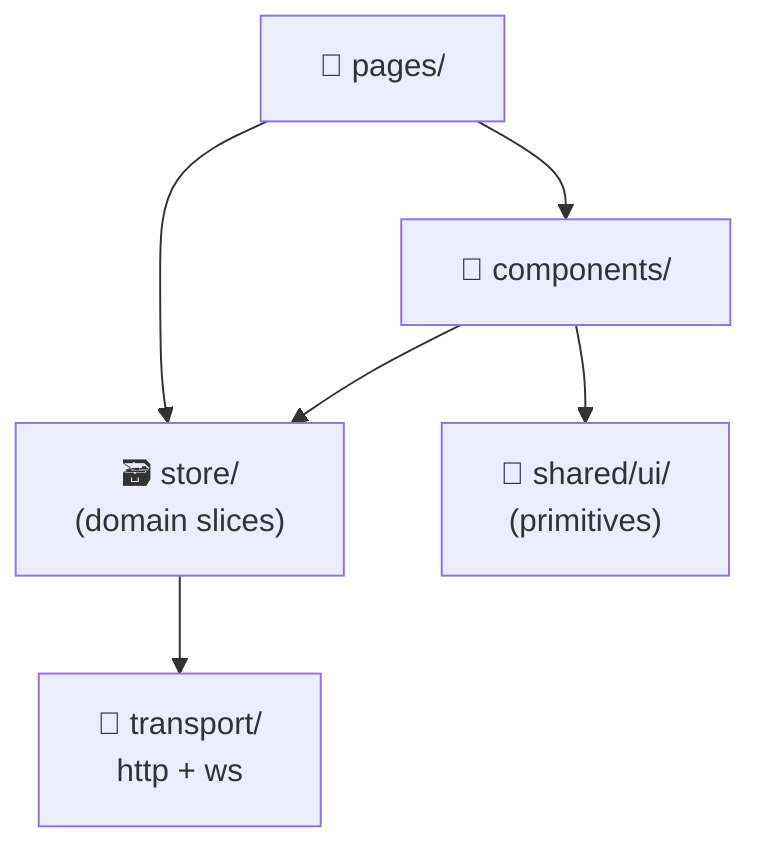

# 🌐 Frontend Overview

React 18 + Vite + TypeScript + Tailwind CSS 4. Architecture is a **modified FSD** (Feature-Sliced Design) — practical, not dogmatic.

## Tech Stack

- **React 18** + Vite (no SSR)
- **TypeScript** (strict)
- **Redux Toolkit** with custom slice pattern (see [Redux](/station/frontend/redux))
- **Tailwind CSS 4** via `@import 'tailwindcss'` + semantic CSS variables
- **React Router** (with route-based code splitting)
- **Axios** for HTTP, native `WebSocket` for WS, JWT in HttpOnly cookies + interceptor refresh
- **lucide-react** for icons
- **i18next** with `ua` (fallback) + `en` locales

## File Structure

```
packages/frontend/src/
├── pages/              — page components, one folder per page
├── components/         — feature-shared components (DeviceCard, TimePicker, AddDeviceModal, ...)
├── shared/
│   ├── ui/             — reusable UI primitives (see UI page)
│   ├── Layout/         — Layout, Sidebar, Header, Breadcrumbs, BottomTabBar
│   ├── tokenStore.ts   — token persistence (localStorage)
│   ├── toast.ts        — re-export of sonner toast
│   ├── useWsSubscription.ts  — WebSocket subscription hook
│   ├── useNavigationBlocker.ts
│   ├── usePolling.ts
│   ├── useViewMode.ts
│   └── formatRelativeTime.ts
├── store/              — Redux slices, by domain
│   ├── {domain}/
│   │   ├── {domain}.slice.ts    — sync reducers only
│   │   ├── {domain}.actions.ts  — async thunks + WS event actions
│   │   └── {domain}.types.ts    — state + payload/param types
│   ├── helpers.ts      — createAppAsyncThunk, withToast, withLoading, makeActionCreator, createSliceHook
│   ├── hooks.ts        — useAppDispatch, useAppSelector
│   └── store.ts
├── transport/
│   ├── http/           — API functions (axios)
│   └── ws/             — WebSocket client + middleware
├── router/             — React Router setup
├── providers/          — context providers
├── i18n.ts             — i18next config
├── colors.css          — semantic color tokens (light + dark)
└── index.css           — Tailwind import + base styles
```

## Layer Boundaries



### Hard rules

- **No transport in UI** — pages and components never `import` from `@/transport/`. All API calls go through thunks in `*.actions.ts`.
- **No barrel exports** — always import from the exact file (`@/shared/ui/Button/Button`).
- **`useTranslation()` for all user-facing text** — never hardcode strings.
- **No inline styles** — Tailwind classes only.
- **No hardcoded hex/rgb** — use semantic tokens (`text-text-primary`, `bg-bg-surface`) or named colors (`text-honolulu-blue`).

## Path Aliases

| Alias | Maps to |
|---|---|
| `@/store/...` | `src/store/...` |
| `@/transport/...` | `src/transport/...` |
| `@/shared/...` | `src/shared/...` |
| `@/components/...` | `src/components/...` |

## Component Pattern

```tsx
type Props = {
  device: Device;
  onClick: () => void;
  showTelemetry?: boolean;
};

export const DeviceCard = ({ device, onClick, showTelemetry = false }: Props) => {
  const { t } = useTranslation();
  return (
    <Card
      className="cursor-pointer hover:border-honolulu-blue/50 transition-colors"
      onClick={onClick}
    >
      <div className="flex items-start justify-between gap-3">
        <span className="font-medium text-text-primary">{device.name}</span>
        <StatusBadge status={device.status} />
      </div>
    </Card>
  );
};
```

- `type Props = ...` (not `interface`) above the component
- Named export, arrow function
- Default values in destructuring (`showTelemetry = false`)

## Modal Pattern

```tsx
<Modal isOpen={isOpen} onClose={onClose} title={t('my.modal.title')}>
  {/* content */}
  <div className="mt-4 flex justify-end gap-2">
    <Button variant="secondary" onClick={onClose}>{t('common.cancel')}</Button>
    <Button onClick={handleSubmit}>{t('common.save')}</Button>
  </div>
</Modal>
```

## Auth Flow

1. JWT stored in HttpOnly cookie (login response sets it)
2. `apiClient` (axios) auto-adds the cookie on every request
3. On `401`, the interceptor calls `/api/auth/refresh` (also cookie-based) and retries the original request
4. On refresh failure → `dispatch(authActions.reset())` + redirect to login

## Reference

- [Frontend conventions ↗](https://github.com/alphaoflogic-ua/smart-home/blob/develop/.claude/rules/frontend.md)
- [Redux pattern conventions ↗](https://github.com/alphaoflogic-ua/smart-home/blob/develop/.claude/rules/svaroh/redux-transport.md)
- [TypeScript conventions ↗](https://github.com/alphaoflogic-ua/smart-home/blob/develop/.claude/rules/svaroh/typescript.md)
