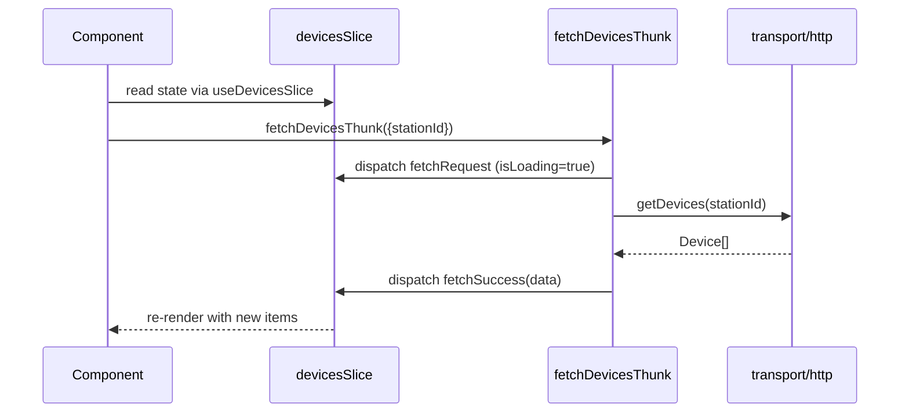

# 🗃️ Redux Pattern

Custom convention used across station + mobile: **slices contain only sync reducers**, thunks dispatch lifecycle actions explicitly. We don't use `createAsyncThunk` lifecycle in `extraReducers` (the standard RTK pattern).

**Why custom?** Explicit dispatch keeps loading/error state under direct control of the thunk body — easier to reason about optimistic updates, retries, and conditional success dispatches without scattering logic across `extraReducers` cases.

## Folder Structure

```
store/
  {domain}/
    {domain}.slice.ts    — createSlice: state + sync reducers only
    {domain}.actions.ts  — async thunks (createAppAsyncThunk) + WS event actions (createAction)
    {domain}.types.ts    — state type + payload/param types
  helpers.ts             — createAppAsyncThunk, withToast, withLoading, makeActionCreator, createSliceHook
  hooks.ts               — useAppDispatch, useAppSelector
  store.ts
```

## Lifecycle



## Slice File

```typescript
// devices.slice.ts
const { actReq, actMutate, actReject } = makeActionCreator<DevicesState>();

const devicesSlice = createSlice({
  name: 'devices',
  initialState,
  reducers: {
    fetchRequest: actReq('isLoading'),
    fetchSuccess: actMutate<Device[]>((devices, state) => {
      state.isLoading = false;
      state.items = {};
      for (const d of devices) state.items[d.id] = d;
    }),
    fetchFailure: actReject<string>('isLoading'),
    reset: () => initialState,
  },
  extraReducers: (builder) => {
    builder
      .addCase(deviceStateChanged, (state, action) => {
        /* WS event */
      })
      .addCase(wsConnectionChanged, (state, action) => {
        /* connection event */
      });
  },
});

export const devicesActions = devicesSlice.actions;
export const devicesReducer = devicesSlice.reducer;
```

`extraReducers` is allowed only for cross-slice WS event actions and `wsConnectionChanged` — not for thunk lifecycle.

## Actions File

```typescript
// devices.actions.ts
import { createAction } from '@reduxjs/toolkit';
import { createAppAsyncThunk, withLoading, withToast } from '@/store/helpers';

// WS event actions (consumed by extraReducers in slice)
export const deviceStateChanged = createAction<DeviceStateMsg>('devices/deviceStateChanged');

// Async thunks — dispatch slice actions explicitly
export const fetchDevicesThunk = createAppAsyncThunk(
  'devices/fetch',
  withLoading(devicesActions, async ({ stationId }: { stationId: string }, { dispatch }) => {
    const data = await api.getDevices(stationId);
    dispatch(devicesActions.fetchSuccess(data));
  }),
);

export const sendCommandThunk = createAppAsyncThunk(
  'devices/sendCommand',
  async (params: SendCommandParams, { dispatch }) => {
    try {
      await withToast(() => api.sendCommand(params.deviceId, params.stationId, params.command));
    } catch (e) {
      dispatch(devicesActions.clearOptimistic({ deviceId: params.deviceId }));
      throw e;
    }
  },
);

// Slice hook — exported from actions.ts (not slice.ts) since it includes thunks
export const useDevicesSlice = createSliceHook('devices', {
  ...devicesActions,
  fetchDevicesThunk,
  sendCommandThunk,
});
```

## Helpers (`store/helpers.ts`)

### `createAppAsyncThunk`

Typed wrapper around `createAsyncThunk`:

```typescript
const createAppAsyncThunk = createAsyncThunk.withTypes<{
  state: RootState;
  dispatch: AppDispatch;
}>();
```

### `withLoading(actions, fn)`

Wraps the thunk body — auto-dispatches `fetchRequest()` before, `fetchFailure(error)` on throw. The success dispatch is explicit inside `fn`.

```typescript
export const fetchDevicesThunk = createAppAsyncThunk(
  'devices/fetch',
  withLoading(devicesActions, async ({ stationId }, { dispatch }) => {
    const data = await api.getDevices(stationId);
    dispatch(devicesActions.fetchSuccess(data));
  }),
);
```

Requires the slice to have `fetchRequest` (no payload) and `fetchFailure(error: string)`.

### `withToast(fn, opts)`

Shows `toast.success` / `toast.error`, **always re-throws**:

```typescript
const result = await withToast(() => api.updateDevice(id, payload), {
  success: i18next.t('devices.updated'),
  errorMessage: (err) =>
    err instanceof HttpError && err.statusCode === 404
      ? i18next.t('devices.notFound')
      : undefined, // undefined → falls back to err.message
});
```

### `makeActionCreator<S>()`

Generates type-safe sync reducer factories for a slice's state `S`:

```typescript
const { actReq, actMutate, actReject, actResolve, act, actEmpty } = makeActionCreator<MyState>();

actReq('isLoading');             // sets isLoading=true, no payload
actMutate<P>((payload, draft));  // immer mutation
actReject<string>('isLoading');  // sets isLoading=false, error=payload
actResolve<P>('data', 'isLoading');  // sets data=payload + isLoading=false
act<P>((payload, state) => Partial<S>);  // returns new partial state (no immer)
actEmpty<P>();                   // no-op reducer (passthrough)
```

`actReq` deliberately takes no generic — it produces an `ActionCreatorWithoutPayload`, important for components that fire `actions.fetchRequest()` with no args.

### `createSliceHook(name, actions)`

Type-safe `(state, actions)` selector hook. Must be exported from `*.actions.ts` (not `.slice.ts`) because it includes thunks alongside sync actions.

```typescript
// single value + one action
const [isRestoring, restoreSession] = useAuthSlice((s, a) => [s.isRestoring, a.restoreSession]);

// multiple values + one action
const [stations, isLoading, fetchStations] = useStationsSlice((s, a) => [
  s.order.map((id) => s.items[id]).filter(Boolean),
  s.isLoading,
  a.fetchStations,
]);

// many actions — pass the whole `a`
const [members, invites, isLoading, actions] = useMembersSlice((s, a) => [
  s.members,
  s.invites,
  s.isLoading,
  a,
]);
actions.fetchMembersThunk(stationId);

// calling bound thunks — .unwrap() works
await resetPasswordThunk({ token, newPassword }).unwrap();
```

**Prefer `createSliceHook` over raw `useAppDispatch`.** If a domain has no meaningful state, create a minimal slice with empty reducers so the hook still works.

## WS Event Action Conventions

WS-driven actions and command-confirmation actions are different categories — naming makes this explicit:

### Naming

- **Wire events** (action originates from incoming WS message): prefix `ws*`. Example: `wsDeviceDeleted`, `wsDeviceStateChanged`. The prefix marks origin: another tab/station/user produced this.
- **Sync confirmations** (action dispatched by our own thunk after a successful API mutation): plain past tense, no prefix. Example: `zoneCreated`, `deviceRemoved`.

The same domain can have both. e.g. devices: `deviceRemoved` after our `DELETE /devices/:id` succeeds, AND `wsDeviceDeleted` when another client deletes a device. Both reducers may do the same state mutation; the names disambiguate the origin.

This intentionally diverges from `smart-home-mobile`, which uses unprefixed past-tense for both categories. Station prioritizes explicit wire/sync separation.

### Location

- **Wire events** are registered in [`ws/wsActionRegistry.ts` ↗](https://github.com/alphaoflogic-ua/smart-home/blob/develop/packages/frontend/src/transport/ws/wsActionRegistry.ts), dispatched by `ws.middleware.ts`.
- The `createAction` lives in the OWNING slice's `*.actions.ts` once the slice is migrated to v2. Temporarily in `ws/ws.actions.ts` if not yet migrated.

## Cross-Slice Reset

Slices expose `reset: () => initialState`. Logout / delete-account thunks dispatch all resets explicitly:

```typescript
dispatch(authActions.reset());
dispatch(devicesActions.reset());
dispatch(deviceTypesActions.reset());
dispatch(membersActions.reset());
dispatch(stationsActions.reset());
```

Do not use `extraReducers` listening to `logoutThunk.fulfilled` — ownership stays with the auth actions file.

## Transport Layer

```typescript
// transport/http/devices.ts
import { apiClient } from './client';

export async function getDevices(stationId: string): Promise<Device[]> {
  const { data } = await apiClient.get<Device[]>(`/devices?stationId=${stationId}`);
  return data;
}
```

- Named async arrow exports
- Use `apiClient` from `client.ts` (axios with auth interceptors + token refresh)
- Type response with generics, return `data` directly

**Re-exporting transport types** — if a screen needs a transport-layer type (`InviteInfo`), re-export it from the actions file:

```typescript
// invites.actions.ts
export type { InviteInfo } from '@/transport/http/invites';
```

The screen imports from `@/store/invites/invites.actions`, never from `@/transport/`.

## Reference

- [helpers.ts source ↗](https://github.com/alphaoflogic-ua/smart-home/blob/develop/packages/frontend/src/store/helpers.ts)
- [Redux/transport conventions ↗](https://github.com/alphaoflogic-ua/smart-home/blob/develop/.claude/rules/svaroh/redux-transport.md)
