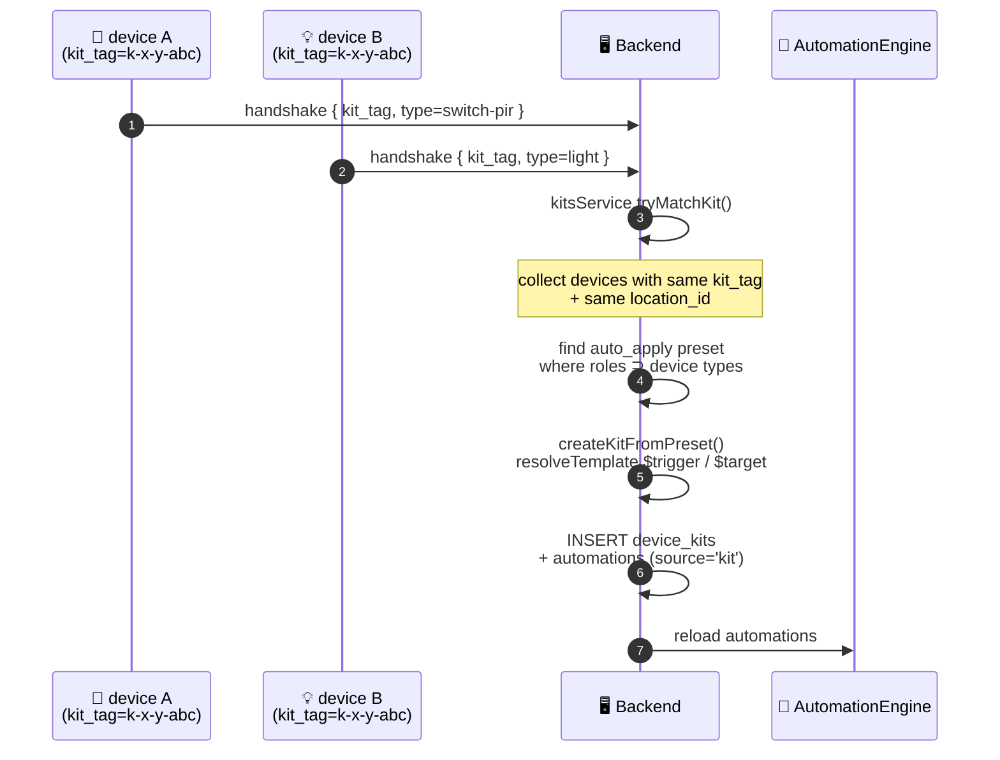

# 🧩 Kits & Kit Automations

Kits pair multiple devices and auto-generate automations from preset templates.

## Auto-Creation Flow {#auto-creation}



## Tables

- `kit_presets` — reusable templates (roles + automation_templates JSON)
- `device_kits` — instances of paired devices
- `automations.kit_id` + `automations.source='kit'` — link automations to kits

## Auto-creation Flow (Detail)

1. Device with `kit_tag` sends handshake → `DEVICE_HANDSHAKE_RECEIVED` event
2. `kitsService.tryMatchKit()` finds all devices with same `kit_tag` + `location_id`
3. If ≥2 devices match, finds `auto_apply=true` presets whose roles match device types
4. `createKitFromPreset()`:
   - Maps role keys (`trigger`, `target`) → actual device IDs
   - `resolveTemplate()` recursively replaces `$trigger`/`$target` in automation template JSON
   - Inserts `device_kits` row + automations with `source='kit'`, `status='published'`
   - Reloads automations into `automationEngine`
5. Duplicate prevention: `(preset_id, devices_hash)` unique constraint

## Preset Structure

```jsonc
{
  "name": "switch-light",
  "roles": [
    { "key": "trigger", "type": "switch-pir" },
    { "key": "target", "type": "light" }
  ],
  "automation_templates": [
    {
      "name": "Button → Toggle Light",
      "nodes": [
        {
          "id": "t1",
          "type": "trigger",
          "position": { "x": 0, "y": 0 },
          "data": {
            "kind": "device_event_received",
            "config": { "deviceId": "$trigger", "eventAction": "button_press" }
          }
        },
        {
          "id": "a1",
          "type": "action",
          "position": { "x": 300, "y": 0 },
          "data": {
            "kind": "device_command",
            "config": { "deviceId": "$target", "command": "toggle" }
          }
        }
      ],
      "edges": [{ "id": "e1", "source": "t1", "target": "a1" }]
    }
  ],
  "auto_apply": true
}
```

## Node Positioning

Nodes use `FlowNode.position: {x, y}` — rendered by ReactFlow on frontend. Currently hardcoded in presets as horizontal line (`y: 0`, x increments by 300).

## Kit Lifecycle

- Kit deleted → CASCADE deletes its automations + engine unregisters
- Device deleted → `onDeviceDeleted()` removes entire kit
- Manual preset apply via `POST /api/kits/:id/apply-preset`

## Key Files

- [`kitsService.ts` ↗](https://github.com/alphaoflogic-ua/smart-home/blob/develop/packages/backend/src/modules/kits/kitsService.ts) — matching, template resolver, CRUD
- [`kitsRepository.ts` ↗](https://github.com/alphaoflogic-ua/smart-home/blob/develop/packages/backend/src/modules/kits/kitsRepository.ts) — DB queries
- [`kitsRoutes.ts` ↗](https://github.com/alphaoflogic-ua/smart-home/blob/develop/packages/backend/src/modules/kits/kitsRoutes.ts) — REST endpoints (`/api/kits`)
- [`003_device_kits.sql` ↗](https://github.com/alphaoflogic-ua/smart-home/blob/develop/packages/backend/src/db/migrations/003_device_kits.sql) — schema + seed presets
- [`automation.ts` ↗](https://github.com/alphaoflogic-ua/smart-home/blob/develop/packages/shared/src/types/automation.ts) — FlowNode, FlowEdge, FlowDefinition types
