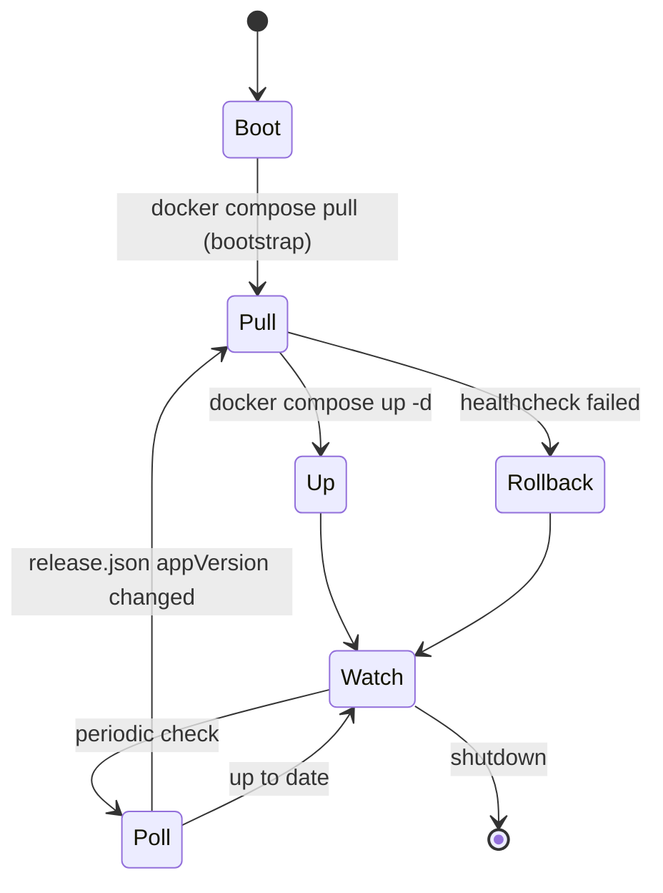
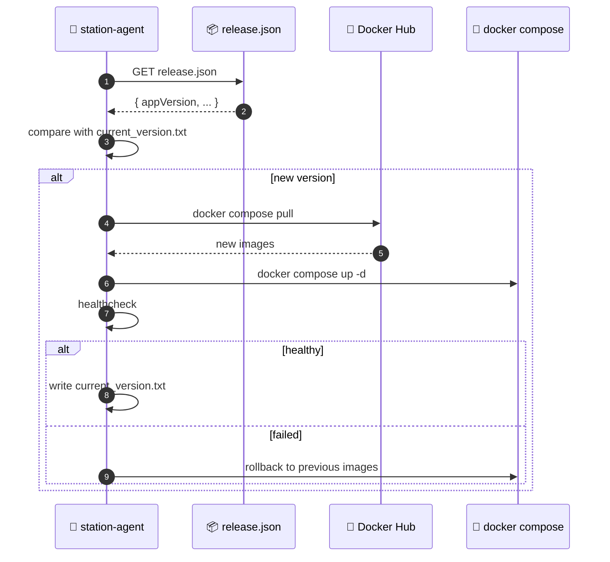

# 🤖 station-agent

Native Node.js binary on Raspberry Pi. Manages Docker containers for backend/frontend and ESP32 OTA firmware updates.

[Source ↗](https://github.com/alphaoflogic-ua/smart-home/tree/develop/station-agent)

## Responsibilities

- Poll `release.json` for new Docker image versions
- Pull and restart Docker stack (`docker compose pull` + `docker compose up -d`) with rollback on failure
- Trigger ESP32 OTA firmware updates
- Expose HTTP API for first-boot bootstrap UI (`smartstation.local`)

:::note Agent binary is NOT self-updating
The agent binary is installed by `install-agent.sh` and managed by systemd. Updating the agent binary requires a new release tag (`agent-v*`) that triggers CI to rebuild and publish — then reinstall manually or via `install-agent.sh`.
:::

## Docker Update Lifecycle

## Docker Update Flow

## Distribution

- Built as SEA (Single Executable Application) from `station-agent/` package
- Published to [`smart-home-updates/station-agent/` ↗](https://github.com/alphaoflogic-ua/smart-home-updates/tree/main/station-agent) on release
- Installed and registered as systemd service by [`install-agent.sh` ↗](https://github.com/alphaoflogic-ua/smart-home-updates/blob/main/install-agent.sh)

## Key Files

- `src/updater.js` — Docker image polling, pull, healthcheck, rollback
- `src/server.js` — HTTP API, periodic checks, firmware updater
- `src/bootstrap.js` — initial Docker stack startup

## Reference

- [station-agent README ↗](https://github.com/alphaoflogic-ua/smart-home/blob/develop/station-agent/README.md)
