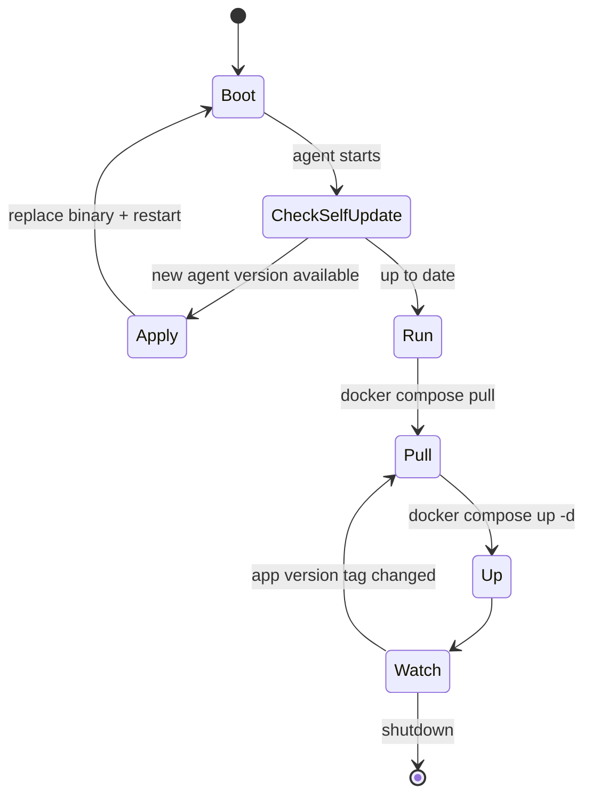
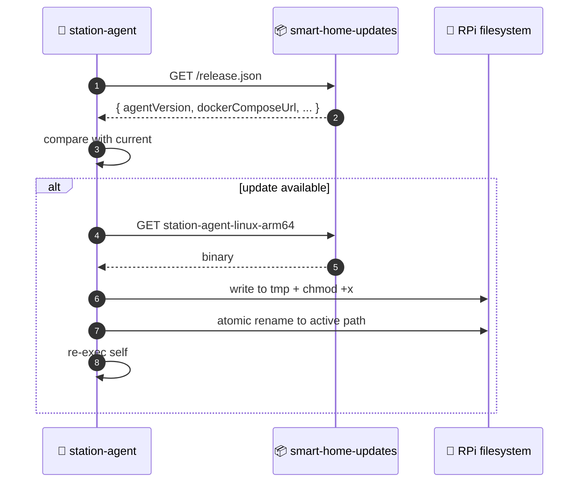

# 🤖 station-agent

Native Node.js binary on Raspberry Pi. Manages Docker containers for backend/frontend, self-updates from public GitHub releases.

[Source ↗](https://github.com/alphaoflogic-ua/smart-home/tree/develop/station-agent)

## Responsibilities

- Pull and run Docker images for backend, frontend, postgres, mqtt
- Self-update — fetch new binary from `smart-home-updates` repo
- Provide Docker Hub credentials to the host (so app images can be pulled)
- Expose health/control endpoints for first-boot bootstrap UI (`smartstation.local`)

## Lifecycle

## Self-Update Flow

## Distribution

- Built in `station-agent/` package (SEA — Single Executable Application)
- Published to [`smart-home-updates/station-agent/` ↗](https://github.com/alphaoflogic-ua/smart-home-updates/tree/main/station-agent) on release
- Installed by [`install-agent.sh` ↗](https://github.com/alphaoflogic-ua/smart-home-updates/blob/main/install-agent.sh)

## Reference

- [station-agent README ↗](https://github.com/alphaoflogic-ua/smart-home/blob/develop/station-agent/README.md)
